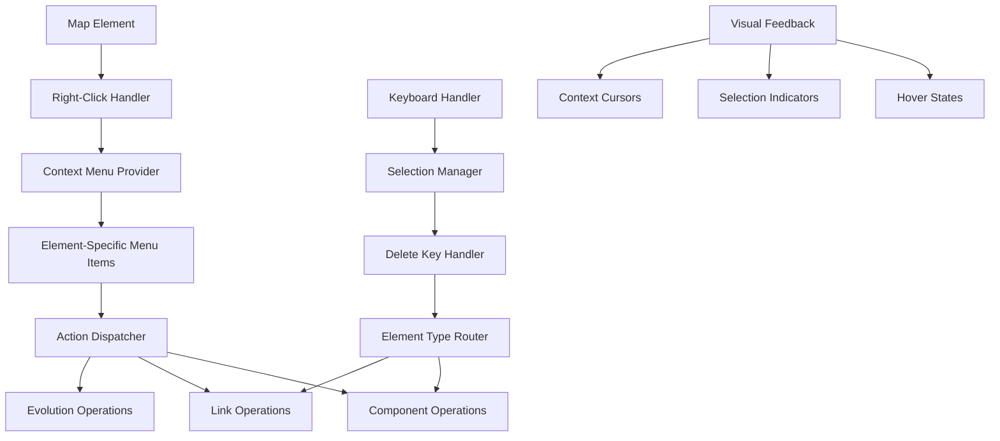
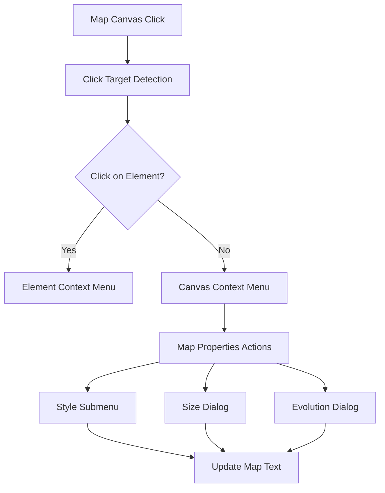

# Design Document

## Overview

The enhanced map editor interactions feature will transform the current click-based editing experience into a comprehensive, modern editor interface with contextual right-click menus, keyboard shortcuts, and streamlined workflows. The design builds upon existing infrastructure including the ContextMenu component, MapComponentDeleter service, toolbar functionality, and evolution system while adding new interaction patterns.

The solution introduces context-sensitive menus that appear based on the element being right-clicked (components, evolved components, or links), unified keyboard handling for deletion operations, and enhanced visual feedback systems to guide user interactions.

## Architecture

### Current Infrastructure Analysis

- **ContextMenu Component**: Already exists with proper styling and positioning logic
- **MapComponentDeleter**: Handles component deletion with map text synchronization
- **Toolbar System**: Comprehensive item configuration with inertia toggle functionality
- **Evolution System**: EvolveExtractionStrategy handles "evolve" syntax parsing and processing
- **Link Management**: Various link strategy classes handle component relationships

### Enhanced Architecture Components



## Components and Interfaces

### 1. Enhanced Context Menu Provider

**Purpose**: Manage context-sensitive menu generation for different element types
**Interface**: Extension of existing ContextMenuProvider
**Responsibilities**:

- Detect element type being right-clicked (component, evolved component, link)
- Generate appropriate menu items based on element properties and state
- Handle menu positioning and lifecycle management
- Coordinate with existing context menu infrastructure

```typescript
interface EnhancedContextMenuProvider {
    showContextMenu(element: MapElement, position: {x: number; y: number}): void;
    generateMenuItems(element: MapElement): ContextMenuItem[];
    handleMenuAction(action: ContextMenuAction, element: MapElement): void;
}

interface MapElement {
    type: 'component' | 'evolved-component' | 'link';
    id: string;
    properties: ComponentProperties | LinkProperties;
}

interface ContextMenuAction {
    type: 'edit' | 'toggleInertia' | 'evolve' | 'delete' | 'rename';
    payload?: any;
}
```

### 2. Component Evolution Manager

**Purpose**: Handle automated component evolution with proper positioning
**Interface**: New service building on evolution extraction strategy
**Responsibilities**:

- Calculate evolution target positions based on source component maturity
- Generate proper "evolve" syntax for map text updates
- Handle evolution stage transitions (Genesis→Custom→Product→Commodity)
- Manage positioning logic for commodity-stage lateral evolution

```typescript
interface ComponentEvolutionManager {
    evolveComponent(component: Component): EvolutionResult;
    calculateEvolutionPosition(sourceMaturity: number): {x: number; y: number};
    generateEvolutionSyntax(sourceName: string, targetName: string, position: number): string;
    getNextEvolutionStage(currentStage: EvolutionStage): EvolutionStage | null;
}

interface EvolutionResult {
    updatedMapText: string;
    evolvedComponent: {
        name: string;
        position: {x: number; y: number};
        evolutionLine: string;
    };
}
```

### 3. Unified Selection Manager

**Purpose**: Handle element selection state and keyboard interactions
**Interface**: New service for managing interactive elements
**Responsibilities**:

- Track currently selected elements (components, links)
- Provide visual selection feedback
- Handle keyboard shortcut routing (Delete key primarily)
- Coordinate with existing UI state management

```typescript
interface SelectionManager {
    selectedElements: SelectedElement[];
    selectElement(element: MapElement): void;
    deselectElement(elementId: string): void;
    clearSelection(): void;
    handleKeyboardAction(key: string): void;
    getSelectionType(): 'none' | 'component' | 'link' | 'mixed';
}

interface SelectedElement {
    id: string;
    type: 'component' | 'evolved-component' | 'link';
    element: MapElement;
}
```

### 4. Enhanced Inline Editor

**Purpose**: Extend existing inline editing for evolved components
**Interface**: Enhancement of current InlineEditor component
**Responsibilities**:

- Support editing evolved component names with proper syntax generation
- Handle "evolve source→newname position" syntax updates
- Validate evolved component name changes
- Integrate with existing double-click editing workflow

```typescript
interface EnhancedInlineEditor extends InlineEditor {
    editEvolvedComponent(evolvedComponent: EvolvedComponent): void;
    generateEvolvedComponentSyntax(sourceName: string, newName: string, position: number): string;
    validateEvolvedComponentName(name: string): boolean;
}
```

### 5. Link Selection and Management

**Purpose**: Enable link selection and deletion workflows
**Interface**: New service for link interaction
**Responsibilities**:

- Detect link clicks and provide visual selection feedback
- Handle link deletion through keyboard and context menu
- Manage link visual states (hover, selected, default)
- Coordinate with existing link rendering components

```typescript
interface LinkSelectionManager {
    selectLink(linkId: string): void;
    deleteSelectedLink(): void;
    isLinkSelected(linkId: string): boolean;
    getSelectedLinkIds(): string[];
    handleLinkClick(linkId: string, event: MouseEvent): void;
}
```

## Data Models

### Context Menu Action Model

```typescript
interface ContextMenuItemDefinition {
    id: string;
    label: string;
    icon?: React.ComponentType;
    action: (element: MapElement) => void;
    isEnabled: (element: MapElement) => boolean;
    isVisible: (element: MapElement) => boolean;
    destructive?: boolean;
}

// Predefined menu actions for different element types
const COMPONENT_MENU_ACTIONS: ContextMenuItemDefinition[] = [
    {
        id: 'edit',
        label: 'Edit Component',
        action: element => startInlineEdit(element),
        isEnabled: () => true,
        isVisible: () => true,
    },
    {
        id: 'toggleInertia',
        label: element => (element.hasInertia ? 'Remove Inertia' : 'Add Inertia'),
        action: element => toggleComponentInertia(element),
        isEnabled: element => element.type === 'component', // Not for evolved components
        isVisible: () => true,
    },
    {
        id: 'evolve',
        label: 'Evolve Component',
        action: element => evolveComponent(element),
        isEnabled: element => !element.isEvolved,
        isVisible: element => !element.isEvolved,
    },
    {
        id: 'delete',
        label: 'Delete Component',
        action: element => deleteComponent(element),
        isEnabled: () => true,
        isVisible: () => true,
        destructive: true,
    },
];
```

### Evolution Positioning Logic

```typescript
interface EvolutionPositioning {
    sourceMaturity: number;
    targetMaturity: number;
    targetVisibility: number;
    positioning: 'nextStage' | 'lateral';
}

const EVOLUTION_STAGES = [
    {name: 'Genesis', range: [0, 0.25], nextStage: 'Custom'},
    {name: 'Custom', range: [0.25, 0.5], nextStage: 'Product'},
    {name: 'Product', range: [0.5, 0.75], nextStage: 'Commodity'},
    {name: 'Commodity', range: [0.75, 1.0], nextStage: null}, // Lateral evolution only
];

const calculateEvolutionTarget = (sourceMaturity: number): EvolutionPositioning => {
    const currentStage = EVOLUTION_STAGES.find(stage => sourceMaturity >= stage.range[0] && sourceMaturity < stage.range[1]);

    if (currentStage?.nextStage) {
        // Move to next evolution stage
        return {
            sourceMaturity,
            targetMaturity: EVOLUTION_STAGES.find(s => s.name === currentStage.nextStage).range[0],
            positioning: 'nextStage',
        };
    } else {
        // Lateral evolution for commodity stage
        return {
            sourceMaturity,
            targetMaturity: sourceMaturity + 0.05, // Slight right movement
            positioning: 'lateral',
        };
    }
};
```

## Error Handling

### Context Menu Edge Cases

1. **Multiple overlapping elements**: Prioritize top-most renderable element
2. **Menu positioning near viewport edges**: Use existing position adjustment logic
3. **Rapid right-clicks**: Debounce menu opening to prevent multiple menus
4. **Element deletion while menu open**: Auto-close menu and clear selection

### Evolution Operation Failures

1. **Invalid source component**: Show error message and prevent evolution
2. **Map text parsing errors**: Rollback operation and show validation message
3. **Position calculation failures**: Use safe default positioning
4. **Name collision in evolution**: Auto-generate unique evolved component name

### Selection Management Edge Cases

```typescript
const handleSelectionErrors = {
    invalidElement: (elementId: string) => {
        console.warn(`Cannot select invalid element: ${elementId}`);
        // Remove from selection if somehow selected
        deselectElement(elementId);
    },

    deletionWhileSelected: (elementId: string) => {
        // Element was deleted externally, clean up selection
        deselectElement(elementId);
        updateSelectionVisuals();
    },

    multipleSelectionConflict: () => {
        // If mixed selection types, limit actions to common operations
        return getCommonActions(selectedElements);
    },
};
```

## Testing Strategy

### 1. Unit Testing

- **Context Menu Generation**: Test menu item generation for different element types and states
- **Evolution Logic**: Test position calculations for all evolution stage transitions
- **Selection Management**: Test selection state changes and keyboard routing
- **Inline Editing**: Test evolved component syntax generation and validation

### 2. Integration Testing

- **Right-Click Workflows**: Test complete right-click to action execution flows
- **Keyboard Shortcuts**: Test Delete key handling across different selected element types
- **Evolution Process**: Test end-to-end component evolution with map text updates
- **Deletion Operations**: Test component and link deletion with proper cleanup

### 3. User Experience Testing

- **Context Menu Positioning**: Test menu positioning across different viewport sizes and scroll states
- **Visual Feedback**: Test hover states, selection indicators, and cursor changes
- **Keyboard Navigation**: Test accessibility and keyboard-only interaction flows
- **Error States**: Test user feedback for failed operations and edge cases

### 4. Cross-Component Integration

```typescript
// Example integration test structure
describe('Enhanced Map Editor Interactions', () => {
    describe('Component Context Menu', () => {
        test('right-click component shows appropriate menu items', () => {
            // Test menu generation based on component state
        });

        test('edit action starts inline editing', () => {
            // Test integration with existing inline editor
        });

        test('evolve action creates evolved component with proper positioning', () => {
            // Test evolution workflow and map text updates
        });
    });

    describe('Keyboard Shortcuts', () => {
        test('Delete key removes selected components', () => {
            // Test integration with MapComponentDeleter
        });

        test('Delete key removes selected links', () => {
            // Test link deletion and map text cleanup
        });
    });
});
```

## Performance Considerations

### Context Menu Optimization

- Lazy-load menu item icons to reduce initial bundle size
- Cache menu configurations for common element types
- Use React.memo for menu item components to prevent unnecessary re-renders
- Debounce rapid right-click events to prevent UI thrashing

### Selection State Management

- Use immutable selection state updates to enable React optimization
- Batch selection change notifications to reduce re-render frequency
- Implement virtual scrolling for large link selection scenarios
- Cache DOM element references for faster selection updates

### Evolution and Positioning Calculations

- Memoize evolution stage calculations for repeated operations
- Pre-calculate common evolution positions for performance
- Use requestAnimationFrame for smooth visual transitions during evolution
- Implement background map text parsing to avoid UI blocking

## Map Canvas Context Menu Extensions

### Canvas Context Menu Provider

**Purpose**: Extend context menu system to handle map canvas right-clicks for map-level operations
**Interface**: Extension of existing ContextMenuProvider with canvas detection
**Responsibilities**:

- Detect right-clicks on empty canvas areas vs map elements
- Generate map-level context menu items (style, size, evolution stages)
- Handle dialog management for complex inputs (size, evolution stages)
- Coordinate with existing map text update mechanisms

```typescript
interface CanvasContextMenuProvider extends EnhancedContextMenuProvider {
    showCanvasContextMenu(position: {x: number; y: number}): void;
    generateCanvasMenuItems(): CanvasContextMenuItem[];
    handleCanvasMenuAction(action: CanvasContextMenuAction): void;
}

interface CanvasContextMenuAction {
    type: 'changeStyle' | 'setSize' | 'editEvolution';
    payload?: {
        style?: 'plain' | 'wardley' | 'colour';
        size?: {width: number; height: number};
        evolution?: {stage1: string; stage2: string; stage3: string; stage4: string};
    };
}
```

### Map Properties Manager

**Purpose**: Handle map-level property updates and DSL generation
**Interface**: New service for managing map metadata
**Responsibilities**:

- Parse existing map properties from map text (style, size, evolution)
- Generate proper DSL syntax for map property updates
- Validate property values and handle edge cases
- Integrate with existing map text update workflows

```typescript
interface MapPropertiesManager {
    getCurrentStyle(): 'plain' | 'wardley' | 'colour' | null;
    getCurrentSize(): {width: number; height: number} | null;
    getCurrentEvolutionStages(): {stage1: string; stage2: string; stage3: string; stage4: string} | null;
    
    updateMapStyle(style: 'plain' | 'wardley' | 'colour'): string;
    updateMapSize(width: number, height: number): string;
    updateEvolutionStages(stages: {stage1: string; stage2: string; stage3: string; stage4: string}): string;
    
    generateStyleDSL(style: string): string;
    generateSizeDSL(width: number, height: number): string;
    generateEvolutionDSL(stage1: string, stage2: string, stage3: string, stage4: string): string;
}
```

### Dialog Components

**Purpose**: Provide user interfaces for complex map property inputs
**Interface**: React components for size and evolution stage editing
**Responsibilities**:

- Size input dialog with width/height validation
- Evolution stages dialog with four stage name inputs
- Form validation and error handling
- Integration with existing UI patterns and styling

```typescript
interface MapSizeDialog {
    isOpen: boolean;
    currentSize: {width: number; height: number} | null;
    onConfirm: (size: {width: number; height: number}) => void;
    onCancel: () => void;
}

interface EvolutionStagesDialog {
    isOpen: boolean;
    currentStages: {stage1: string; stage2: string; stage3: string; stage4: string} | null;
    onConfirm: (stages: {stage1: string; stage2: string; stage3: string; stage4: string}) => void;
    onCancel: () => void;
}
```

## Enhanced Architecture Components

### Canvas Click Detection



### Map Properties DSL Integration

```typescript
// DSL syntax patterns for map properties
const MAP_PROPERTY_PATTERNS = {
    style: /^style\s+(plain|wardley|colour)\s*$/m,
    size: /^size\s+\[(\d+),\s*(\d+)\]\s*$/m,
    evolution: /^evolution\s+(.+?)->(.+?)->(.+?)->(.+?)\s*$/m,
};

const DSL_GENERATORS = {
    style: (style: string) => `style ${style}`,
    size: (width: number, height: number) => `size [${width}, ${height}]`,
    evolution: (s1: string, s2: string, s3: string, s4: string) => `evolution ${s1}->${s2}->${s3}->${s4}`,
};
```

## Data Models

### Canvas Context Menu Configuration

```typescript
const CANVAS_MENU_ITEMS: CanvasContextMenuItemDefinition[] = [
    {
        id: 'changeStyle',
        label: 'Change Map Style',
        submenu: [
            {
                id: 'style-plain',
                label: 'Plain',
                action: () => updateMapStyle('plain'),
                isSelected: () => getCurrentStyle() === 'plain',
            },
            {
                id: 'style-wardley',
                label: 'Wardley',
                action: () => updateMapStyle('wardley'),
                isSelected: () => getCurrentStyle() === 'wardley',
            },
            {
                id: 'style-colour',
                label: 'Colour',
                action: () => updateMapStyle('colour'),
                isSelected: () => getCurrentStyle() === 'colour',
            },
        ],
    },
    {
        id: 'setSize',
        label: 'Set Map Size',
        action: () => openSizeDialog(),
        isEnabled: () => true,
        isVisible: () => true,
    },
    {
        id: 'editEvolution',
        label: 'Edit Evolution Stages',
        action: () => openEvolutionDialog(),
        isEnabled: () => true,
        isVisible: () => true,
    },
];
```

### Map Property Validation

```typescript
const VALIDATION_RULES = {
    mapSize: {
        width: {
            min: 100,
            max: 5000,
            validate: (value: number) => Number.isInteger(value) && value >= 100 && value <= 5000,
            errorMessage: 'Width must be an integer between 100 and 5000',
        },
        height: {
            min: 100,
            max: 5000,
            validate: (value: number) => Number.isInteger(value) && value >= 100 && value <= 5000,
            errorMessage: 'Height must be an integer between 100 and 5000',
        },
    },
    
    evolutionStages: {
        validate: (stage: string) => stage.trim().length > 0 && stage.length <= 50,
        errorMessage: 'Stage names must be 1-50 characters long',
        defaultStages: ['Genesis', 'Custom Built', 'Product', 'Commodity'],
    },
};
```

## Error Handling

### Canvas Context Menu Edge Cases

1. **Rapid canvas clicks**: Debounce canvas context menu to prevent multiple menus
2. **Menu positioning**: Use existing positioning logic to handle viewport edges
3. **Dialog state management**: Ensure only one dialog open at a time
4. **Map text parsing failures**: Show validation errors and prevent invalid updates

### Map Property Update Failures

```typescript
const handleMapPropertyErrors = {
    invalidStyle: (style: string) => {
        showError(`Invalid map style: ${style}. Valid options are: plain, wardley, colour`);
    },
    
    invalidSize: (width: number, height: number) => {
        showError(`Invalid map size: ${width}x${height}. Dimensions must be positive integers.`);
    },
    
    invalidEvolution: (stages: string[]) => {
        showError('Evolution stages cannot be empty. Please provide names for all four stages.');
    },
    
    mapTextUpdateFailed: (error: Error) => {
        showError(`Failed to update map: ${error.message}`);
        // Rollback to previous state
    },
};
```

## Accessibility Enhancements

### Keyboard Navigation Support

- Tab order management for context menu items and submenus
- Arrow key navigation within context menus
- Screen reader announcements for selection changes and operations
- High contrast mode support for selection indicators
- Dialog keyboard navigation (Tab, Enter, Escape)

### ARIA Implementation

```typescript
const accessibilityAttributes = {
    contextMenu: {
        role: 'menu',
        'aria-label': 'Component actions',
        'aria-expanded': 'true',
    },

    canvasContextMenu: {
        role: 'menu',
        'aria-label': 'Map settings',
        'aria-expanded': 'true',
    },

    styleSubmenu: {
        role: 'menu',
        'aria-label': 'Map style options',
        'aria-expanded': 'true',
    },

    sizeDialog: {
        role: 'dialog',
        'aria-label': 'Set map size',
        'aria-modal': 'true',
    },

    evolutionDialog: {
        role: 'dialog',
        'aria-label': 'Edit evolution stages',
        'aria-modal': 'true',
    },

    selectedComponent: {
        'aria-selected': 'true',
        'aria-describedby': 'selection-help-text',
    },

    evolvedComponent: {
        'aria-label': `Evolved component ${componentName}`,
        role: 'button',
        tabIndex: 0,
    },

    selectionAnnouncement: {
        'aria-live': 'polite',
        'aria-atomic': 'true',
    },
};
```
