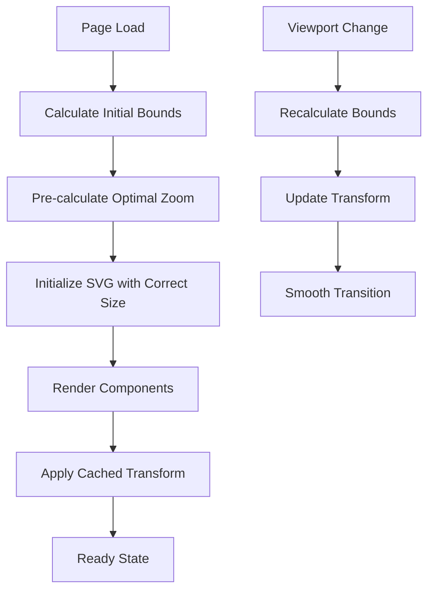

# Design Document

## Overview

The map canvas performance optimization addresses the slow initial loading and sizing issues where the map appears too large and requires SVG pan zoom adjustments to fit properly. The current implementation uses a delayed `fitSelection` approach with multiple timeouts and DOM polling, which creates a poor user experience with visible resizing and slow response times.

The solution involves implementing intelligent initial sizing calculations, optimizing the SVG pan zoom initialization, and creating efficient viewport adaptation mechanisms that provide immediate, properly-sized map display.

## Architecture

### Current Implementation Analysis

The existing system has several performance bottlenecks:

1. **Delayed Fit Approach**: Uses `setTimeout` with 800ms + 1500ms delays and DOM polling
2. **Multiple Render Cycles**: Components render before proper sizing is calculated
3. **Reactive Sizing**: Waits for components to render before calculating optimal viewport
4. **Inefficient Bounds Calculation**: Repeatedly queries DOM for component positions

### Proposed Architecture



## Components and Interfaces

### 1. MapBoundsCalculator

A utility class responsible for calculating optimal map bounds and zoom levels.

```typescript
interface MapBounds {
  minX: number;
  minY: number;
  maxX: number;
  maxY: number;
  width: number;
  height: number;
}

interface OptimalViewport {
  zoom: number;
  centerX: number;
  centerY: number;
  transform: SVGTransform;
}

class MapBoundsCalculator {
  calculateMapBounds(components: UnifiedComponent[], anchors: UnifiedComponent[]): MapBounds;
  calculateOptimalViewport(bounds: MapBounds, canvasDimensions: MapCanvasDimensions): OptimalViewport;
  getMarginAdjustedBounds(bounds: MapBounds): MapBounds;
}
```

### 2. ViewportManager

Manages viewport state and transformations with caching for performance.

```typescript
interface ViewportState {
  bounds: MapBounds;
  viewport: OptimalViewport;
  canvasDimensions: MapCanvasDimensions;
  lastCalculated: number;
}

class ViewportManager {
  private cache: Map<string, ViewportState>;
  
  getOptimalViewport(
    components: UnifiedComponent[], 
    anchors: UnifiedComponent[], 
    canvasDimensions: MapCanvasDimensions
  ): OptimalViewport;
  
  invalidateCache(reason: string): void;
  shouldRecalculate(components: UnifiedComponent[], canvasDimensions: MapCanvasDimensions): boolean;
}
```

### 3. Enhanced UnifiedMapCanvas

Modified canvas component with optimized initialization.

```typescript
interface EnhancedMapCanvasProps extends ModernUnifiedMapCanvasProps {
  enableOptimizedSizing?: boolean;
  initialSizingTimeout?: number;
}

// New hooks for performance optimization
const useOptimalViewport = (
  components: UnifiedComponent[],
  anchors: UnifiedComponent[],
  canvasDimensions: MapCanvasDimensions
) => OptimalViewport;

const useViewportCache = () => ViewportManager;
```

### 4. Performance Monitoring

```typescript
interface PerformanceMetrics {
  initialSizingTime: number;
  componentRenderTime: number;
  transformApplicationTime: number;
  totalLoadTime: number;
}

class PerformanceMonitor {
  startTiming(operation: string): string;
  endTiming(timerId: string): number;
  getMetrics(): PerformanceMetrics;
}
```

## Data Models

### MapBounds
```typescript
interface MapBounds {
  minX: number;        // Leftmost component position
  minY: number;        // Topmost component position  
  maxX: number;        // Rightmost component position
  maxY: number;        // Bottommost component position
  width: number;       // Calculated width
  height: number;      // Calculated height
  hasComponents: boolean; // Whether map contains any components
}
```

### OptimalViewport
```typescript
interface OptimalViewport {
  zoom: number;        // Calculated zoom level (0.1 to 2.0)
  centerX: number;     // Center X coordinate
  centerY: number;     // Center Y coordinate
  transform: {         // SVG transform matrix
    a: number;         // Scale X
    b: number;         // Skew Y
    c: number;         // Skew X
    d: number;         // Scale Y
    e: number;         // Translate X
    f: number;         // Translate Y
  };
  margins: {           // Applied margins
    left: number;
    top: number;
    right: number;
    bottom: number;
  };
}
```

## Error Handling

### Graceful Degradation Strategy

1. **Bounds Calculation Failure**: Fall back to default map dimensions
2. **Component Position Errors**: Use estimated positions based on maturity/visibility
3. **Transform Calculation Issues**: Apply identity transform with default zoom
4. **Performance Timeout**: Cancel optimization and use standard initialization

### Error Recovery Mechanisms

```typescript
interface FallbackStrategy {
  maxCalculationTime: number;    // 100ms timeout
  defaultZoom: number;          // 0.8 fallback zoom
  defaultCenter: {x: number, y: number}; // Map center
  retryAttempts: number;        // Max 2 retries
}
```

## Testing Strategy

### Core Tests
- MapBoundsCalculator with basic component scenarios (empty, single, multiple)
- ViewportManager caching and invalidation
- Error handling and fallback behavior


## Implementation Phases

### Phase 1: Core Bounds Calculation
- Implement MapBoundsCalculator
- Add component position analysis
- Create optimal viewport calculation logic

### Phase 2: Viewport Management
- Implement ViewportManager with caching
- Add performance monitoring
- Integrate with existing UnifiedMapCanvas

### Phase 3: Optimization & Polish
- Add error handling and fallbacks
- Implement smooth transitions
- Performance tuning and testing

### Phase 4: Advanced Features
- Responsive sizing for different screen sizes
- Memory optimization for large maps
- Advanced caching strategies

## Performance Targets

- **Initial Sizing**: Complete within 100ms
- **Component Rendering**: No visible layout shifts
- **Zoom Application**: Smooth, immediate response
- **Memory Usage**: <50MB additional overhead
- **Large Maps**: Handle 100+ components efficiently
- **Mobile Performance**: Maintain 60fps during interactions