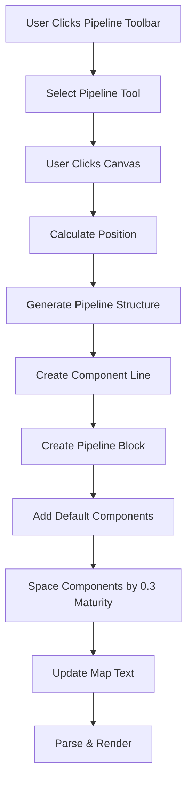
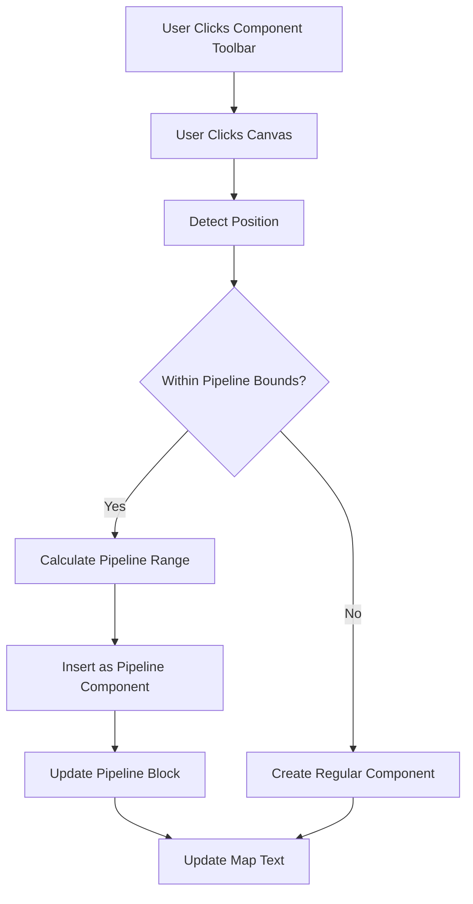
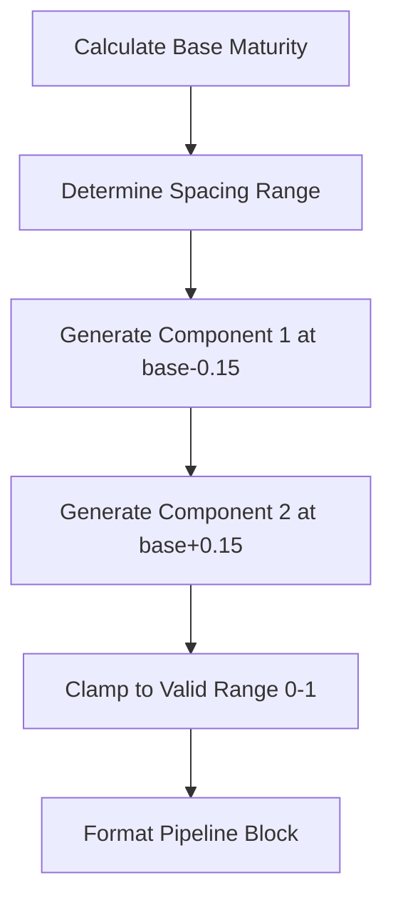
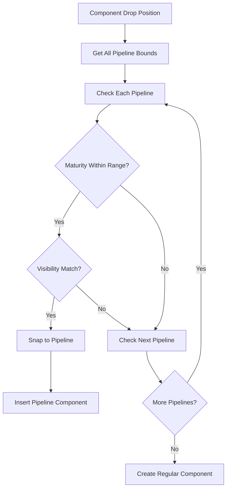
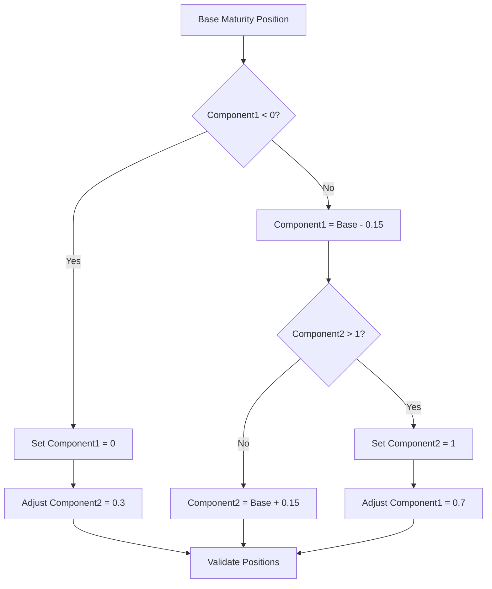
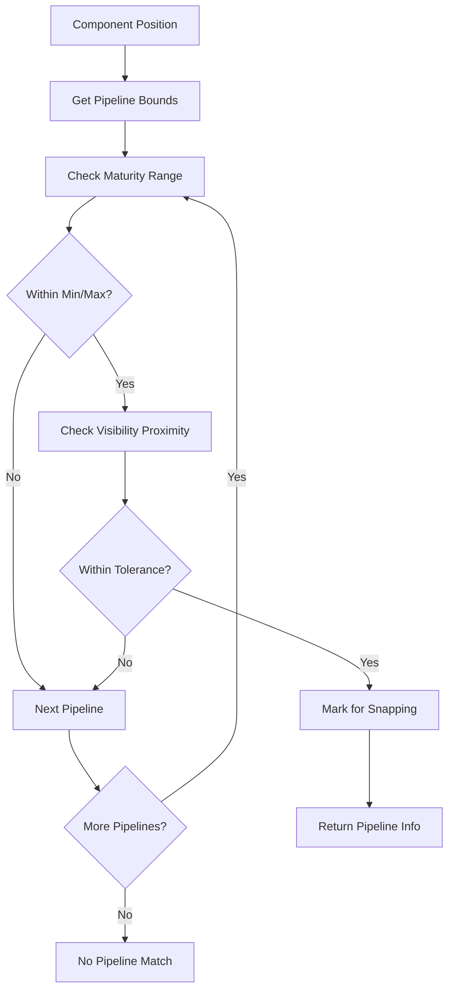

# Pipeline Toolbar Fix Design

## Overview

This design addresses the incorrect WYSIWYG toolbar behavior for pipeline components. The current pipeline toolbar item only generates a single `pipeline` line, but it should generate both a `component` line and a `pipeline` block with default child components, properly spaced to avoid overlap.

The enhancement also includes intelligent component insertion that automatically adds components to existing pipelines when placed within pipeline maturity bounds.

## Architecture

### Current Pipeline Implementation Analysis

The existing system has these key components:
- `toolbarItems.ts` - Pipeline toolbar configuration with template function
- `PipelineExtractionStrategy.ts` - Parses pipeline DSL syntax
- `UnifiedConverter.ts` - Transforms pipeline data structures
- `mapTextGeneration.ts` - Handles component placement logic
- `useMapHandlers.ts` - Manages toolbar item drop events

### Enhanced Pipeline Toolbar Workflow



### Component Insertion Enhancement



## DSL Syntax Structure

### Target Pipeline Structure
The enhanced pipeline toolbar should generate:

```wardley
component Kettle [0.45, 0.57]
pipeline Kettle
{
    component Pipeline Component 1 [0.30]
    component Pipeline Component 2 [0.60]
}
```

### Component Addition to Pipeline
When adding component "foobar" to an existing pipeline:

```wardley
component Kettle [0.45, 0.57]
pipeline Kettle
{
    component foobar [0.50] label [-10, -10]
    component Pipeline Component 1 [0.30]
    component Pipeline Component 2 [0.60]
}
```

## Enhanced Template Functions

### Modified Pipeline Template

```typescript
const ENHANCED_PIPELINE_TEMPLATE = {
    pipeline: (name: string, y: string, x: string) => {
        const mainComponent = `component ${name} [${y}, ${x}]`;
        const pipelineBlock = generatePipelineBlock(name, parseFloat(x));
        return `${mainComponent}\n${pipelineBlock}`;
    }
};
```

### Pipeline Component Generation Logic



## Pipeline Bounds Detection System

### Maturity Range Calculation

For pipeline bounds detection, the system analyzes existing pipeline components to determine the maturity range:

```typescript
interface PipelineBounds {
    name: string;
    minMaturity: number;
    maxMaturity: number;
    visibility: number;
}

function calculatePipelineBounds(pipeline: PipelineData): PipelineBounds {
    const maturities = pipeline.components.map(c => c.maturity);
    return {
        name: pipeline.name,
        minMaturity: Math.min(...maturities),
        maxMaturity: Math.max(...maturities),
        visibility: pipeline.visibility
    };
}
```

### Component Snapping Logic



## Component Spacing Algorithm

### Default Component Positioning

The system calculates optimal spacing for default pipeline components:

```typescript
function calculateComponentPositions(
    baseMaturiry: number, 
    spacing: number = 0.3
): { component1: number; component2: number } {
    const component1 = Math.max(0, baseMaturiry - spacing/2);
    const component2 = Math.min(1, baseMaturiry + spacing/2);
    
    return { component1, component2 };
}
```

### Spacing Constraints



## Text Generation Enhancement

### Enhanced Map Text Generation

The `mapTextGeneration.ts` utility requires enhancement to support complex pipeline structures:

```typescript
export function generatePipelineMapText(
    item: ToolbarItem,
    componentName: string,
    position: { x: number; y: number }
): string {
    const formattedY = formatCoordinate(position.y);
    const formattedX = formatCoordinate(position.x);
    
    const componentLine = `component ${componentName} [${formattedY}, ${formattedX}]`;
    const pipelineBlock = generatePipelineBlock(componentName, position.x);
    
    return `${componentLine}\n${pipelineBlock}`;
}

function generatePipelineBlock(pipelineName: string, baseMaturiy: number): string {
    const positions = calculateComponentPositions(baseMaturiy);
    
    return `pipeline ${pipelineName}
{
    component Pipeline Component 1 [${positions.component1.toFixed(2)}]
    component Pipeline Component 2 [${positions.component2.toFixed(2)}]
}`;
}
```

### Pipeline Component Insertion

```typescript
export function insertPipelineComponent(
    mapText: string,
    pipelineName: string,
    componentName: string,
    maturity: number,
    labelOffset?: { x: number; y: number }
): string {
    const lines = mapText.split('\n');
    const pipelineBlockStart = findPipelineBlockStart(lines, pipelineName);
    
    if (pipelineBlockStart === -1) {
        throw new Error(`Pipeline ${pipelineName} not found`);
    }
    
    const componentLine = formatPipelineComponent(componentName, maturity, labelOffset);
    return insertComponentInPipelineBlock(lines, pipelineBlockStart, componentLine);
}
```

## Component Detection Enhancement

### Enhanced Position Validation

The position validation system needs enhancement to detect pipeline bounds:

```typescript
interface PositionValidation {
    isValid: boolean;
    errors: string[];
    nearPipeline?: PipelineBounds;
    shouldSnapToPipeline?: boolean;
}

export function validatePositionWithPipelineDetection(
    position: { x: number; y: number },
    wardleyMap: UnifiedWardleyMap
): PositionValidation {
    const basicValidation = validatePosition(position);
    
    if (!basicValidation.isValid) {
        return { ...basicValidation, shouldSnapToPipeline: false };
    }
    
    const nearPipeline = detectNearbyPipeline(position, wardleyMap.pipelines);
    
    return {
        ...basicValidation,
        nearPipeline,
        shouldSnapToPipeline: nearPipeline !== undefined
    };
}
```

### Pipeline Detection Algorithm



## Integration Points

### Toolbar Item Configuration

Update the pipeline toolbar item configuration:

```typescript
{
    id: 'pipeline',
    label: 'Pipeline',
    icon: ToolbarPipelineIcon,
    template: ENHANCED_PIPELINE_TEMPLATE.pipeline,
    category: 'pipeline',
    defaultName: DEFAULT_COMPONENT_NAMES.pipeline,
    toolType: 'placement',
    keyboardShortcut: 'p',
    generatesPipelineBlock: true, // New flag
}
```

### Map Handler Enhancement

Enhance `useMapHandlers.ts` to support pipeline-aware component placement:

```typescript
const handleToolbarItemDrop = useCallback(
    (item: ToolbarItem, position: {x: number; y: number}) => {
        const validation = validatePositionWithPipelineDetection(position, props.wardleyMap);
        
        if (!validation.isValid) {
            showUserFeedback(validation.errors[0], 'error');
            return;
        }
        
        if (item.id === 'component' && validation.shouldSnapToPipeline) {
            handlePipelineComponentInsertion(validation.nearPipeline!, position);
        } else {
            handleRegularComponentPlacement(item, position);
        }
    },
    [props, toolbarState, showUserFeedback]
);
```

### Pipeline Component Insertion Handler

```typescript
function handlePipelineComponentInsertion(
    pipeline: PipelineBounds,
    position: { x: number; y: number }
): void {
    try {
        const componentName = generateUniqueComponentName({
            baseName: 'New Component',
            existingNames: getAllComponentNames(props.wardleyMap)
        });
        
        const updatedMapText = insertPipelineComponent(
            props.mapText,
            pipeline.name,
            componentName,
            position.x
        );
        
        props.mutateMapText(
            updatedMapText,
            'toolbar-component',
            `Added component "${componentName}" to pipeline "${pipeline.name}"`
        );
        
        showUserFeedback(
            `Component "${componentName}" added to pipeline "${pipeline.name}"`,
            'success'
        );
    } catch (error) {
        console.error('Pipeline component insertion failed:', error);
        showUserFeedback('Failed to add component to pipeline', 'error');
    }
}
```

## Testing Strategy

### Unit Testing

Test the enhanced template generation:

```typescript
describe('Enhanced Pipeline Template', () => {
    it('should generate complete pipeline structure', () => {
        const result = ENHANCED_PIPELINE_TEMPLATE.pipeline('Kettle', '0.45', '0.57');
        
        expect(result).toContain('component Kettle [0.45, 0.57]');
        expect(result).toContain('pipeline Kettle');
        expect(result).toContain('component Pipeline Component 1 [0.42]');
        expect(result).toContain('component Pipeline Component 2 [0.72]');
    });
    
    it('should handle edge cases for component positioning', () => {
        const result = ENHANCED_PIPELINE_TEMPLATE.pipeline('Edge', '0.45', '0.05');
        const positions = extractComponentPositions(result);
        
        expect(positions[0]).toBeGreaterThanOrEqual(0);
        expect(positions[1]).toBeLessThanOrEqual(1);
    });
});
```

### Integration Testing

Test pipeline component insertion:

```typescript
describe('Pipeline Component Insertion', () => {
    it('should detect pipeline bounds correctly', () => {
        const position = { x: 0.5, y: 0.6 };
        const validation = validatePositionWithPipelineDetection(position, mockWardleyMap);
        
        expect(validation.shouldSnapToPipeline).toBe(true);
        expect(validation.nearPipeline?.name).toBe('Test Pipeline');
    });
    
    it('should insert component in correct pipeline block format', () => {
        const result = insertPipelineComponent(
            existingMapText,
            'Kettle',
            'foobar',
            0.50
        );
        
        expect(result).toContain('component foobar [0.50]');
        expect(result).not.toContain('component foobar [0.50, 0.57]'); // No visibility for pipeline components
    });
});
```

### Visual Regression Testing

Ensure the enhanced pipeline toolbar produces expected visual results:

```typescript
describe('Pipeline Visual Rendering', () => {
    it('should render pipeline with spaced default components', async () => {
        // Test pipeline placement and verify component spacing
        const result = await placePipelineAndCapture();
        expect(result.componentSpacing).toBeGreaterThan(0.25);
    });
    
    it('should highlight pipeline bounds during component placement', async () => {
        // Test component hover over pipeline bounds
        const highlightState = await hoverComponentOverPipeline();
        expect(highlightState.pipelineBoundsHighlighted).toBe(true);
    });
});
```

## Performance Considerations

### Optimization Strategies

1. **Pipeline Bounds Caching**: Cache calculated pipeline bounds to avoid recalculation during component placement
2. **Lazy Template Generation**: Generate pipeline block components only when needed
3. **Efficient Text Parsing**: Use optimized regex patterns for pipeline block detection
4. **Position Calculation Memoization**: Memoize component position calculations for repeated operations

### Memory Management

```typescript
const pipelineBoundsCache = new Map<string, PipelineBounds>();

function getCachedPipelineBounds(pipeline: PipelineData): PipelineBounds {
    const cacheKey = `${pipeline.name}-${pipeline.components.length}`;
    
    if (!pipelineBoundsCache.has(cacheKey)) {
        pipelineBoundsCache.set(cacheKey, calculatePipelineBounds(pipeline));
    }
    
    return pipelineBoundsCache.get(cacheKey)!;
}
```