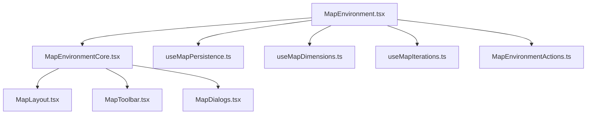
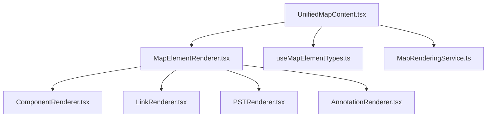
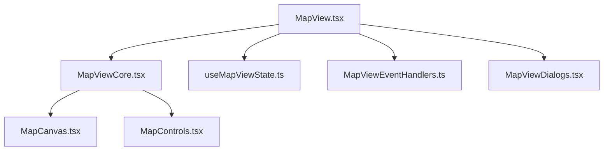
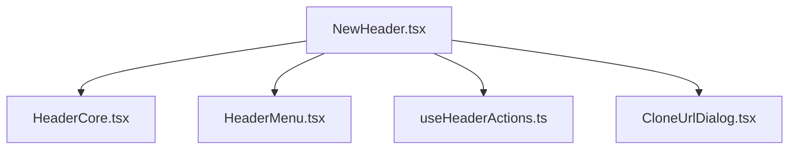
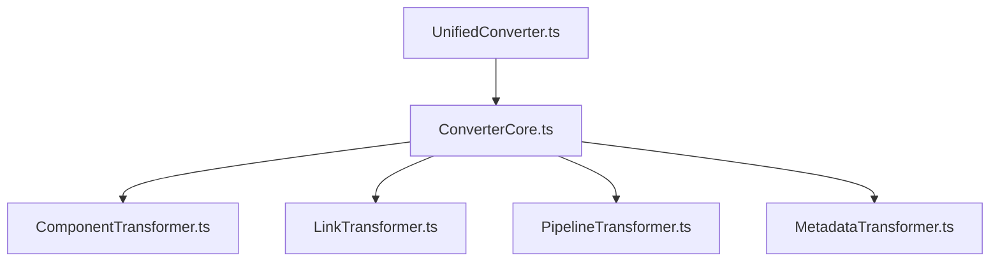

# OnlineWardleyMaps Frontend Refactoring Plan

## Overview

This refactoring plan targets the largest and most complex files in the OnlineWardleyMaps TypeScript frontend, focusing on reducing complexity while maintaining functionality. The plan follows the established code conventions emphasizing simplicity, single responsibility principle, and avoiding overengineering.

## Technology Stack & Context

- **Frontend Framework**: Next.js with React and TypeScript
- **Package Manager**: Yarn (run commands in `/frontend` directory)
- **Development Commands**:
  - `yarn dev` - Start development server
  - `yarn build` - Production build
  - `yarn test` - Run tests
  - `yarn lint` - Code linting

## Architecture Overview

The application follows a service-oriented architecture with:
- **Components**: React components for UI
- **Hooks**: Custom hooks for state and business logic
- **Services**: Framework-agnostic business logic
- **Converters**: Map text parsing and transformation
- **Types**: TypeScript interfaces and types

## Priority Files for Refactoring

### 1. MapEnvironment.tsx (627 lines) - HIGH PRIORITY

**Current Issues:**
- Monolithic component handling multiple concerns
- Complex state management with 20+ useState hooks
- Mixed UI and business logic
- Large useEffect blocks with complex dependencies
- Tight coupling between map operations and component lifecycle

**Refactoring Strategy:**


**Implementation Plan:**
1. **Extract Custom Hooks** (Phase 1)
   - `useMapPersistence` - Handle save/load operations
   - `useMapDimensions` - Manage canvas sizing and resize logic
   - `useMapIterations` - Handle map versions/iterations
   - `useMapActions` - Consolidate map manipulation functions

2. **Extract UI Components** (Phase 2)
   - `MapLayout` - Layout structure and navigation
   - `MapToolbar` - Header and toolbar functionality
   - `MapDialogs` - Modal dialogs and overlays

3. **Create Service Layer** (Phase 3)
   - `MapPersistenceService` - Save/load logic
   - `MapDimensionService` - Dimension calculations
   - `MapValidationService` - Map validation logic

### 2. UnifiedMapContent.tsx (627 lines) - HIGH PRIORITY

**Current Issues:**
- Massive component with 25+ props
- Complex rendering logic for multiple map element types
- Tight coupling between different map element types
- Repetitive conditional rendering patterns

**Refactoring Strategy:**


**Implementation Plan:**
1. **Extract Element Renderers** (Phase 1)
   - `ComponentRenderer` - Handle component rendering
   - `LinkRenderer` - Handle link rendering
   - `PSTRenderer` - Handle PST element rendering
   - `AnnotationRenderer` - Handle annotations and notes

2. **Create Rendering Service** (Phase 2)
   - `MapRenderingService` - Centralize rendering logic
   - `ElementPositionService` - Handle positioning calculations

3. **Simplify Props Interface** (Phase 3)
   - Consolidate related props into configuration objects
   - Use composition pattern for optional features

### 3. MapView.tsx (390 lines) - MEDIUM PRIORITY

**Current Issues:**
- Complex coordination between multiple custom hooks
- Dense event handling logic
- Mixed concerns: UI state, business logic, and rendering

**Refactoring Strategy:**


**Implementation Plan:**
1. **Extract Event Handling** (Phase 1)
   - `MapViewEventHandlers` - Centralize all event handling
   - `useMapViewState` - Consolidate view-specific state

2. **Extract Dialog Components** (Phase 2)
   - `MapViewDialogs` - Handle map size and evolution dialogs
   - Separate dialog state management

3. **Simplify Core Component** (Phase 3)
   - Focus on composition and coordination
   - Delegate specific concerns to specialized components

### 4. NewHeader.tsx (228 lines) - MEDIUM PRIORITY

**Current Issues:**
- Large inline menu definition
- Mixed state and UI logic
- Complex event handling patterns

**Refactoring Strategy:**


**Implementation Plan:**
1. **Extract Menu Component** (Phase 1)
   - `HeaderMenu` - Standalone menu component
   - `useHeaderActions` - Menu action handlers

2. **Extract Dialog Components** (Phase 2)
   - `CloneUrlDialog` - Separate dialog component
   - Simplify dialog state management

3. **Streamline Core Header** (Phase 3)
   - Focus on layout and button actions
   - Delegate complex logic to hooks and services

### 5. UnifiedConverter.ts (176 lines) - LOW PRIORITY

**Current Issues:**
- Single class handling multiple transformation types
- Growing complexity as new element types are added

**Refactoring Strategy:**


**Implementation Plan:**
1. **Extract Specialized Transformers** (Phase 1)
   - `ComponentTransformer` - Handle component transformations
   - `LinkTransformer` - Handle link transformations
   - `PipelineTransformer` - Handle pipeline transformations

2. **Create Transformation Registry** (Phase 2)
   - `TransformerRegistry` - Manage different transformers
   - Enable plugin-like extensibility

## Refactoring Implementation Strategy

### Phase 1: Extract Business Logic (Weeks 1-2)
1. Extract custom hooks from MapEnvironment.tsx
2. Extract specialized transformers from UnifiedConverter.ts
3. Create service layer abstractions
4. **Commit frequently** after each hook extraction

### Phase 2: Extract UI Components (Weeks 3-4)
1. Extract UI components from large files
2. Create specialized renderers for UnifiedMapContent.tsx
3. Extract dialog components
4. **Test thoroughly** after each component extraction

### Phase 3: Consolidate and Optimize (Week 5)
1. Consolidate prop interfaces
2. Optimize component composition
3. Final testing and integration
4. **Build and test often** throughout

## Testing Strategy

### Regression Prevention
1. **Unit Tests**: Create tests for extracted hooks and services
2. **Integration Tests**: Maintain existing integration test coverage
3. **Visual Tests**: Ensure UI components render correctly
4. **Manual Testing**: Test critical user workflows

### Test-Driven Refactoring
1. Write tests for current behavior before refactoring
2. Extract code while maintaining green tests
3. Refactor tests alongside code
4. Add new tests for extracted components

## Git Strategy

### Commit Guidelines
1. **Small, atomic commits** for each extraction
2. **Descriptive commit messages** explaining the refactoring step
3. **Feature branches** for each major file refactoring
4. **Regular integration** with main branch

### Branch Structure
```
main
├── refactor/map-environment
├── refactor/unified-map-content
├── refactor/map-view
├── refactor/header-components
└── refactor/converters
```

## Code Quality Guidelines

### Single Responsibility Principle
- Each extracted component/hook should have one clear purpose
- Avoid creating "god" hooks or components
- Focus on specific, well-defined responsibilities

### Simplicity First
- Implement the simplest solution that works
- Avoid over-abstraction or premature optimization
- Prefer composition over inheritance
- Keep extracted modules focused and small

### Error Handling
- Maintain existing error handling patterns
- Add appropriate error boundaries for new components
- Ensure graceful degradation for failed operations

## Performance Considerations

### React Performance
- Use `useMemo` and `useCallback` appropriately in extracted hooks
- Minimize prop drilling through component extraction
- Ensure stable component references

### Bundle Size
- Avoid creating unnecessary abstractions that increase bundle size
- Use tree-shaking friendly exports
- Monitor bundle size impact during refactoring

## Migration Safety

### Backward Compatibility
- Maintain all existing public APIs during refactoring
- Use adapter patterns where necessary
- Ensure no breaking changes to component interfaces

### Feature Flags
- Use existing feature switches for new patterns where appropriate
- Enable gradual rollout of refactored components
- Provide fallback to original implementations if needed

## Success Criteria

### Code Quality Metrics
- Reduce cyclomatic complexity in target files by 50%
- Decrease file sizes to under 200 lines for most components
- Improve test coverage for extracted modules

### Functionality Requirements
- All existing features continue to work
- No performance regressions
- Maintain accessibility compliance
- Preserve all keyboard shortcuts and user interactions

### Development Experience
- Faster development iteration
- Easier to add new features
- Clearer code organization
- Better error messages and debugging

## Risk Mitigation

### Major Risks
1. **Breaking existing functionality**
   - Mitigation: Comprehensive testing at each step
   - Rollback plan: Feature branches for easy reversion

2. **Performance degradation**
   - Mitigation: Performance testing during refactoring
   - Monitoring: Bundle size and runtime performance metrics

3. **Increased complexity through over-abstraction**
   - Mitigation: Follow simplicity-first principle
   - Regular code reviews to prevent over-engineering

### Rollback Strategy
- Each phase can be rolled back independently
- Feature flags enable quick disabling of new patterns
- Git history provides clear reversion points