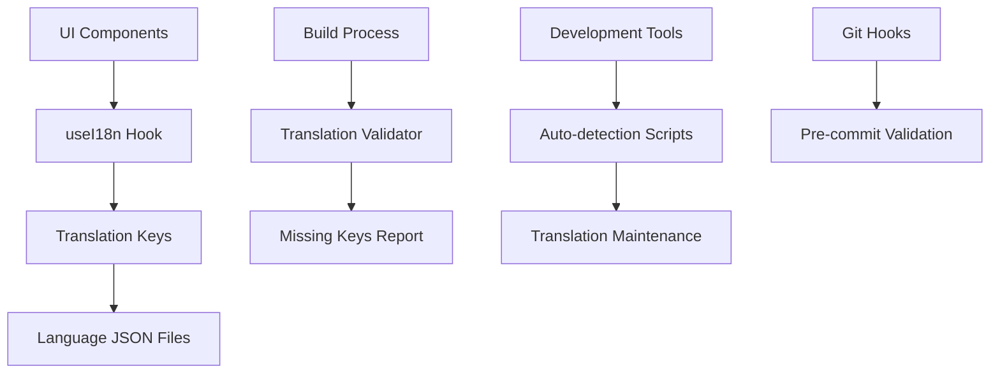

# Design Document

## Overview

The localization improvements will address gaps in the current i18n implementation by systematically identifying, translating, and maintaining all user-facing strings. The solution builds on the existing react-i18next infrastructure and useI18n hook, extending coverage to recently added features and implementing automated validation processes.

The design focuses on three main areas: immediate localization of missing strings, process improvements to prevent future gaps, and tooling enhancements for maintainers and contributors.

## Architecture

### Current I18n Infrastructure
- **Framework**: react-i18next with Next.js integration
- **Hook**: Custom useI18n hook with localStorage persistence and SSR support
- **Languages**: 10 supported languages (en, es, fr, de, it, pt, ja, zh, ko, ru)
- **Storage**: JSON files in `/public/locales/{lang}/common.json`
- **Validation**: Existing scripts in `/scripts/` directory

### Enhanced Architecture Components



## Components and Interfaces

### 1. Missing String Detection
**Purpose**: Identify untranslated strings in UI components
**Interface**: Enhanced `find-untranslated.js` script
**Responsibilities**:
- Scan all React components for hardcoded strings
- Detect missing i18n usage in aria-label, title, and text content
- Generate detailed reports with file and line information
- Support filtering by component type or directory

### 2. Translation Key Management
**Purpose**: Maintain consistent key naming and structure
**Interface**: New `translation-manager.js` utility
**Responsibilities**:
- Generate consistent key names following established patterns
- Validate key structure across all language files
- Detect orphaned or unused translation keys
- Provide key renaming and refactoring capabilities

### 3. Automated Translation Validation
**Purpose**: Ensure translation completeness in CI/CD pipeline
**Interface**: Enhanced validation scripts
**Responsibilities**:
- Verify all keys exist in all supported languages
- Check JSON structure integrity
- Validate interpolation variable consistency
- Generate actionable error reports for missing translations

### 4. Component-Level Localization
**Purpose**: Systematic localization of specific component categories
**Interface**: Component-specific localization modules
**Responsibilities**:
- **Toolbar Components**: Tooltips, button labels, accessibility text
- **Context Menus**: Menu items, shortcuts, descriptions
- **Editor Features**: Undo/redo messages, validation errors, help text
- **Map Elements**: Component labels, evolution stages, link types

## Data Models

### Translation Key Structure
```typescript
interface TranslationKey {
  key: string;           // e.g., "toolbar.undo.tooltip"
  namespace: string;     // e.g., "toolbar"
  category: string;      // e.g., "undo"
  type: string;         // e.g., "tooltip"
  defaultValue: string; // English fallback
  context?: string;     // Usage context for translators
}
```

### Language Completeness Model
```typescript
interface LanguageStatus {
  code: string;           // Language code (e.g., "es")
  totalKeys: number;      // Total keys expected
  translatedKeys: number; // Keys with translations
  missingKeys: string[];  // Array of missing key paths
  completionRate: number; // Percentage complete
  lastUpdated: Date;      // Last modification time
}
```

### Component Localization Status
```typescript
interface ComponentStatus {
  filePath: string;          // Component file path
  untranslatedStrings: {
    type: 'text' | 'aria' | 'title' | 'placeholder';
    content: string;
    line: number;
    suggestedKey?: string;
  }[];
  localizationScore: number; // 0-100 percentage
}
```

## Error Handling

### Missing Translation Scenarios
1. **Key Not Found**: Display English fallback with console warning in development
2. **Malformed JSON**: Fail gracefully with error reporting and English fallback
3. **Network Issues**: Use cached translations or localStorage backup
4. **Invalid Interpolation**: Show key name with parameters for debugging

### Build-Time Validation Failures
1. **Missing Keys**: Fail build with detailed report of required translations
2. **JSON Structure Errors**: Provide line-by-line error information
3. **Inconsistent Variables**: Report mismatched interpolation parameters
4. **Orphaned Keys**: Warn about unused translations without failing build

### Runtime Error Recovery
```typescript
const ErrorBoundary = {
  translationError: (key: string, error: Error) => {
    console.warn(`Translation error for key "${key}":`, error);
    return key; // Fallback to key name
  },
  
  fallbackChain: [
    'user_selected_language',
    'saved_preference',
    'browser_language', 
    'english_default'
  ]
}
```

## Testing Strategy

### 1. Automated Testing
- **Unit Tests**: Test useI18n hook behavior across language changes
- **Integration Tests**: Verify component localization in different languages
- **E2E Tests**: Validate complete user flows in non-English languages
- **Accessibility Tests**: Ensure ARIA labels work with screen readers in all languages

### 2. Translation Validation Testing
- **Schema Validation**: JSON structure and key consistency tests
- **Content Validation**: Placeholder and interpolation variable tests
- **Completeness Testing**: Missing key detection across all language files
- **Format Testing**: Character encoding and special character handling

### 3. Build Pipeline Integration
```yaml
# Example CI integration
translation_validation:
  steps:
    - name: Check missing translations
      run: npm run check-translations
    - name: Validate JSON structure
      run: npm run validate-translation-files
    - name: Test untranslated strings
      run: npm run find-untranslated --strict
```

### 4. Manual Testing Protocols
- **Language Switching**: Verify UI updates immediately on language change
- **Fallback Behavior**: Test behavior when translations are missing
- **RTL Support**: Validate right-to-left language display (Arabic, Hebrew if added)
- **Cultural Appropriateness**: Review translations for cultural context

## Implementation Phases

### Phase 1: Immediate Fixes
- Localize currently identified untranslated strings
- Add missing keys to all language files
- Update components to use i18n hooks consistently

### Phase 2: Process Enhancement  
- Integrate validation into build pipeline
- Create automated detection for new untranslated content
- Establish clear contribution guidelines for translations

### Phase 3: Maintenance Tools
- Develop translation management utilities
- Create automated translation key generation
- Implement translation usage analytics and cleanup tools

## Performance Considerations

### Bundle Size Impact
- Translation files are loaded on demand per language
- Only active language translations loaded in production
- Compression and tree-shaking for unused keys

### Runtime Performance
- Translation caching with localStorage persistence
- Memoized translation function to prevent unnecessary re-renders  
- Lazy loading of language resources

### Build Performance
- Parallel validation of translation files
- Incremental validation of only changed translation keys
- Fast-fail on critical translation errors