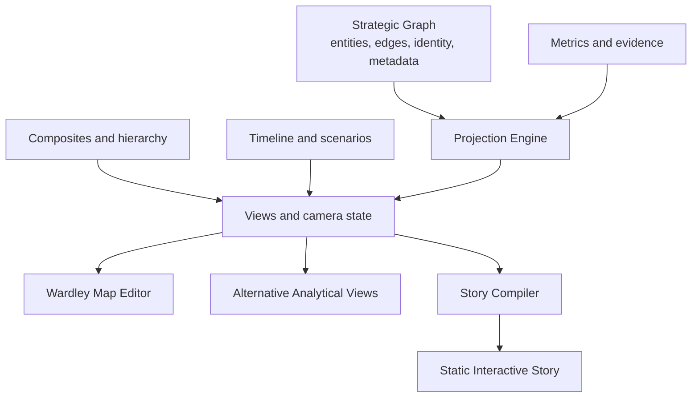

# Master Product and Architecture Specification

**Working title:** Strategic Graph Platform  
**Document status:** Draft 0.1  
**Implementation status:** Proposed architecture; repository audit completed, M0 evidence in progress  
**Primary constraint:** Evolve the working application incrementally

## 1. Executive summary

The existing application is a working fork of Online Wardley Maps. The purpose of this programme is to extend it so that users can model, analyse, animate, simplify, and communicate strategic systems without losing the familiar Wardley mapping experience.

The proposed architecture is based on one central distinction:

- the **strategic graph** records durable entities, relationships, metadata, and identity;
- a **view** records what a user is looking at;
- a **projection** maps graph and metric data into a coordinate space;
- a **timeline** describes how graph, view, and projection state change;
- a **story** presents selected states as an interactive narrative.

A Wardley Map therefore remains a primary product experience, but it is no longer the only possible representation of the model.

This distinction allows the application to support:

1. lassoing nodes and collapsing them into a composite without destroying their internal structure;
2. moving through keyframes with a time slider and animated transitions;
3. changing frames of reference so the same graph is redrawn using different axes or metrics;
4. publishing selected states as a self-contained interactive web story;
5. validating behaviour against a controlled corpus of canonical and independently created maps;
6. supporting future reusable components, scenario branches, analysis, and assisted authoring.

## 2. Product outcome

The desired product is a strategic modelling environment in which an author can move fluidly between detail and abstraction, between present and possible futures, and between analysis and communication.

A representative end-to-end workflow is:

1. The author opens an existing Wardley Map with no migration surprise.
2. The author lassos a dense part of the map and creates a named composite.
3. The composite collapses to a proxy node while all internal nodes and edges remain intact.
4. The author creates keyframes representing current state, planned transition, and intended future state.
5. The author scrubs the timeline and sees nodes, dependencies, labels, and annotations transition according to explicit policies.
6. The author changes the projection from Wardley visibility/evolution to cost/risk or centrality/adoption.
7. The author selects a sequence of states, adds narrative chapters, and exports a static interactive story.
8. Continuous integration verifies that current map import, editing, export, composite, timeline, projection, and story behaviours remain correct.

## 3. Scope

### 3.1 In scope

- Preservation and characterization of current map editing behaviour.
- A canonical graph-oriented domain model or adapter layer.
- Stable identity and schema versioning.
- Non-destructive composites with collapse and expansion.
- Views and projections separated from graph topology.
- Metric definitions and values usable as projection inputs.
- Linear keyframes and animated timeline playback.
- A schema that can later support scenario branching.
- Static narrative publishing with chapters and scroll-driven transitions.
- A canonical map fixture corpus with provenance controls.
- Unit, property, migration, browser, visual, accessibility, security, and performance tests.
- Agent-oriented work orders, ADRs, quality gates, and traceability.

### 3.2 Deferred or optional scope

- Real-time multi-user collaboration.
- A cloud account, hosted database, or server-side publishing service.
- Machine-learned embeddings.
- Automatic strategy generation or autonomous decision-making.
- A general-purpose graph database migration.
- Full plug-in marketplace infrastructure.
- Arbitrary user-authored JavaScript inside published stories.
- Pixel-perfect reproduction of every third-party map.

These may become future capabilities, but the architecture should leave appropriate seams without making the first releases dependent on them.

### 3.3 Explicit non-goals

- Replacing the current application merely to obtain a preferred framework.
- Treating every requested feature as a reason to create a separate subsystem with its own duplicate data model.
- Conflating node screen position with node identity or business meaning.
- Hiding uncertainty in automatically calculated metrics or layouts.
- Using AI output as the unreviewed source of strategic truth.

## 4. Stakeholders and users

### Strategy author

Creates and maintains maps, groups detail, adds metrics, defines keyframes, and compares frames of reference.

### Facilitator

Uses maps in workshops, progressively reveals detail, switches projections, and records alternative scenarios.

### Reviewer or decision-maker

Consumes a simplified view, inspects supporting detail, examines assumptions, and compares current and proposed states.

### Trainer or publisher

Turns selected states into a guided interactive explanation that can be shared without the full editing environment.

### Maintainer

Protects existing users and file formats while extending the application.

### Coding or review agent

Consumes precise work orders, repository evidence, tests, ADRs, and acceptance criteria to produce controlled changes.

## 5. Architectural proposition

The existing renderer and editor should initially become the implementation of the **Wardley view adapter**, not be discarded. New domain and application boundaries are introduced around working behaviour.

## 6. Core invariants

The following invariants should hold across every implementation milestone:

1. Every persisted entity has a stable identifier independent of label and array order.
2. Existing graph topology is not destroyed by collapsing a composite.
3. A view or projection may change coordinates and visibility, but not silently change graph meaning.
4. Loading and re-saving an unchanged map is semantically lossless.
5. Unknown fields from newer compatible formats are preserved where feasible.
6. Projection output is deterministic for equivalent inputs and configuration.
7. A timeline state can be resolved deterministically at any supported time.
8. Story output can be tested without depending on a remote service.
9. Major data changes have explicit migrations and backward-compatibility tests.
10. Any derived value records its definition, input, and confidence or missing-data state where appropriate.

## 7. Capability model

### 7.1 Strategic graph

The graph contains nodes and edges with stable identity, labels, descriptions, types, attributes, metric values, evidence references, and lifecycle information. It does not store renderer objects or DOM references.

### 7.2 Composite hierarchy

A composite records membership and display policies. Collapsing is a view operation. Original members and edges remain available for expansion, editing, testing, and export.

### 7.3 View

A view records the projection, visible entity set, collapse state, style overrides, labels, annotations, filters, and camera. Multiple views can reference the same graph.

### 7.4 Projection

A projection maps entities into a normalized coordinate space using manual values, metrics, graph-derived values, or a declared layout function. The initial Wardley projection preserves the current product semantics.

### 7.5 Timeline

A timeline links keyframes and transition policies. Keyframes may override positions, visibility, labels, styles, metrics, and structural lifecycle state. The first UI may be linear while the data model allows later scenario branching.

### 7.6 Story

A story is an ordered set of chapters. Each chapter references a map state, view, projection, time, camera, and narrative content. The compiler emits deterministic static assets.

## 8. Evolution strategy

The transformation follows an incremental, compatibility-first path:

1. Audit the repository and record current behaviour.
2. Add characterization and round-trip tests around the existing model and renderer.
3. Introduce stable IDs and schema-version adapters without changing the user experience.
4. Extract or wrap a graph-domain boundary.
5. Represent the current Wardley layout as an explicit view/projection.
6. Add composites behind a feature flag.
7. Add timeline state and interpolation.
8. Add story compilation.
9. Expand metrics and alternative projections.
10. Add reusable components, scenario branching, and assisted analysis only after the lower layers are stable.

At each step, the application remains usable and current documents remain recoverable.

## 9. Cross-cutting requirements

### Compatibility

- Existing supported files open successfully.
- Existing export formats continue to work unless explicitly deprecated.
- Migrations are deterministic and reversible where practical.
- Current keyboard and editing workflows are preserved or intentionally superseded with documented alternatives.

### Accessibility

- All primary editing actions have keyboard equivalents.
- Published stories support semantic headings, focus order, reduced motion, and non-colour cues.
- Motion can be reduced or disabled.

### Security

- Imported labels and rich text are treated as untrusted input.
- Story compilation escapes or sanitizes user content.
- Exported stories do not execute arbitrary map-authored JavaScript.
- External assets are opt-in and clearly identified.

### Performance

Performance budgets must be baselined against the current application during the audit. Initial provisional targets are recorded in the feature specifications and must be adjusted with evidence rather than preference.

### Observability

In development and test environments, commands, migrations, projection failures, and story compilation errors should produce structured diagnostics. User telemetry is not assumed and requires a separate privacy decision.

## 10. Documentation set

This master document is supported by:

- vision and principles;
- current-state audit;
- domain model;
- target architecture and migration;
- file format and versioning;
- feature specifications;
- test and corpus strategy;
- security, privacy, and accessibility requirements;
- technical standards;
- agent build guide;
- roadmap and risk register;
- ADRs, schemas, examples, requirements, and traceability.

## 11. Approval gates

### Gate A — Repository baseline

The repository builds, runs, and tests in a reproducible environment. Current import/export and common editing flows are documented and protected by tests.

### Gate B — Domain seam

The application can obtain graph entities through a stable internal boundary without changing visible behaviour.

### Gate C — Versioned persistence

Schema versions, migrations, stable IDs, and round-trip checks are in place.

### Gate D — First vertical feature

Composite selection, collapse, expand, save, load, undo, and export work end to end behind a controlled release mechanism.

### Gate E — Temporal and projection foundation

A view state can be resolved at a keyframe and under a declared projection without contaminating graph identity.

### Gate F — Publishable story

A representative map can be compiled to a static, accessible, testable story and viewed without the editor.

## 12. Success measures

The programme is successful when:

- existing maps and workflows remain dependable;
- complex maps can be simplified and restored without loss;
- time and alternative frames of reference are first-class rather than export tricks;
- story output is useful for briefings and training;
- every major capability is backed by deterministic fixtures and automated tests;
- coding agents can implement bounded work without reconstructing architecture from informal prompts;
- future features extend the same model instead of creating incompatible islands.
