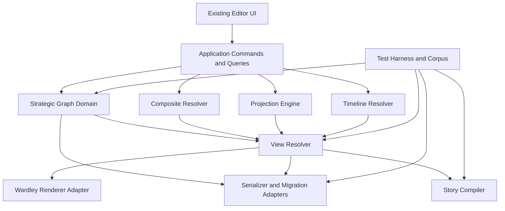
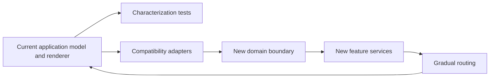

# Target Architecture and Incremental Migration

## 1. Purpose

This document defines a target set of responsibilities and boundaries, not a required directory tree or framework replacement. The repository audit must map these responsibilities onto the existing implementation and identify the smallest safe sequence of changes.

## 2. Architecture style

The recommended style is a modular application with a pure or mostly pure domain core and adapters around current UI, persistence, rendering, and export behaviour.



The implementation may initially retain current state structures behind these interfaces. Architecture is achieved by controlled dependency direction and explicit contracts, not by creating folders with architectural names.

## 3. Target responsibilities

### 3.1 Editor shell

Owns application composition, routes, menus, panels, feature flags, document lifecycle, error surfaces, and integration with the current UI framework.

It must not become the place where graph invariants, migration logic, or projection formulas are implemented ad hoc.

### 3.2 Application commands and queries

Coordinates user intentions such as creating a composite or moving a keyframe. It:

- loads current state;
- invokes domain validation;
- applies atomic changes;
- records undo/redo information;
- emits diagnostics;
- marks the document dirty;
- triggers derived view resolution.

Illustrative interface:

```ts
interface CommandBus {
  execute(command: ApplicationCommand): CommandResult;
  undo(): CommandResult;
  redo(): CommandResult;
}
```

The existing reducer/action model may satisfy this role if commands are made explicit and invariants are centralized.

### 3.3 Strategic graph domain

Owns entities, stable IDs, graph topology, composites, metrics, evidence references, and referential validation. It should be testable without a browser or renderer.

### 3.4 Projection engine

Consumes graph entities, metric values, a projection definition, and optional constraints. Produces normalized positions and diagnostics. It does not mutate graph identity.

```ts
interface ProjectionEngine {
  project(input: ProjectionInput): ProjectionResult;
}
```

### 3.5 Timeline resolver

Resolves base document plus selected scenario, keyframes, and transition policies at time `t`.

```ts
interface TimelineResolver {
  resolve(input: TimelineResolveInput): ResolvedTemporalState;
}
```

It must support exact keyframe resolution independently of animation.

### 3.6 Composite resolver

Converts graph and view collapse state into a display graph containing visible nodes, proxy nodes, original edges, and bundled boundary-edge descriptors.

```ts
interface CompositeResolver {
  resolve(graph: StrategicGraph, composites: Composite[], view: ViewDefinition): DisplayGraph;
}
```

### 3.7 View resolver

Combines graph, projection output, temporal state, composite display state, filters, style, and camera into a renderer-neutral display model.

### 3.8 Wardley renderer adapter

Maps the renderer-neutral display model into the existing Wardley renderer. This is the main compatibility bridge. It should initially preserve current visual and interaction behaviour as closely as possible.

### 3.9 Serializer and migration adapters

Own format detection, parsing, schema validation, migration, compatibility diagnostics, and deterministic writing.

```ts
interface DocumentCodec {
  canRead(input: unknown): boolean;
  read(input: unknown): ReadResult;
  write(document: StrategicMapDocument, options?: WriteOptions): WriteResult;
}
```

Legacy formats may use adapters that map only supported features and report loss before export.

### 3.10 Story compiler

Consumes a validated story and map state and emits static assets. It is separated from the interactive editor so that export can be deterministic and tested in isolation.

### 3.11 Test harness and canonical corpus

Provides semantic fixtures, migrations, browser journeys, visual snapshots, and provenance metadata. It is a first-class subsystem because it protects both the old application and the new architecture.

## 4. Dependency rules

1. Domain modules do not import UI or renderer modules.
2. Projection and timeline modules do not access browser globals.
3. Serializer modules may depend on domain types but not on editor components.
4. The renderer receives resolved display state and emits interaction intents; it does not directly persist domain changes.
5. Story output uses a versioned runtime contract and does not import the full editor bundle by default.
6. Feature code uses stable interfaces rather than reaching into the existing state store from arbitrary components.
7. Cross-layer exceptions require an ADR.

## 5. Compatibility-first migration pattern

The recommended transformation resembles a strangler pattern around a working core:



### Step 0 — Freeze evidence, not development

Record the audited commit and create representative fixtures. Development can continue, but the transformation branch needs a known baseline.

### Step 1 — Add characterization tests

Protect import, save, render, undo/redo, and key editing flows. Avoid major refactoring before this safety net exists.

### Step 2 — Introduce stable IDs and schema versioning

If absent, add IDs through adapters and migrations while preserving existing visual behaviour. Ensure old files still open.

### Step 3 — Create a graph access seam

Expose current nodes and edges through a repository-neutral interface. At first, this seam may be a facade over existing state.

### Step 4 — Make the current map an explicit view

Represent current coordinates, visibility, and style as a default Wardley view. The renderer should continue to receive equivalent data.

### Step 5 — Route one vertical feature through the seam

Composite nodes are a suitable first vertical feature because they exercise selection, identity, graph topology, view state, rendering, persistence, undo/redo, and tests.

### Step 6 — Add timeline and projection services

Once view state is explicit, keyframes and alternative projections can modify or derive that state without rewriting the graph.

### Step 7 — Add story compilation

Use the same resolved state contract to render read-only stories.

### Step 8 — Retire redundant paths deliberately

Only remove legacy representations after their consumers have migrated, equivalence tests pass, and rollback is understood.

## 6. Data migration strategy

### 6.1 Schema version

Every advanced-format document must contain a schema version. Legacy formats without one are detected by adapter rules and assigned a source version internally.

### 6.2 Migration pipeline

```text
raw input
  -> format detection
  -> parse
  -> source validation
  -> sequential migrations
  -> current-domain validation
  -> compatibility diagnostics
  -> editor state
```

Migrations should be sequential, such as `v1 -> v2 -> v3`, rather than a collection of untracked direct conversions.

### 6.3 Preservation

Where possible:

- retain unknown extension fields;
- retain original source text or a checksum for diagnostics;
- preserve legacy ordering if users rely on it;
- record migration warnings;
- allow the user to save a copy rather than overwriting the original automatically.

### 6.4 Downgrade and legacy export

Not every advanced document can be represented in a legacy Wardley format. The exporter must classify features as:

- fully representable;
- representable after flattening or selecting a state;
- representable with metadata loss;
- not representable.

The user must receive a preview or diagnostic rather than silent loss.

## 7. Feature flags and release controls

Major capabilities should have controlled activation during development and early release. A flag should:

- have a stable name;
- define default state by environment;
- be testable in both states while transitional;
- avoid changing persisted format unless the new feature is actually used;
- have an owner and removal condition.

Illustrative flags:

- `graphModelV2`
- `compositeNodes`
- `timelineEditor`
- `projectionWorkbench`
- `storyPublisher`

Actual naming should follow repository conventions.

## 8. Undo and redo

Composite creation, collapse, projection changes, and keyframe edits must be atomic from the user's perspective.

Preferred strategies include:

- command objects with inverse commands;
- immutable state patches with inverse patches;
- transaction snapshots at bounded granularity.

The audit determines which fits the existing state-management approach. A complete replacement of undo/redo is not required if current mechanisms can represent the new operations safely.

## 9. Error and diagnostic model

Errors should be classified:

- validation error;
- migration warning or failure;
- compatibility loss;
- projection input error;
- timeline reference error;
- story compilation error;
- internal invariant violation.

Diagnostics should include stable codes, human-readable messages, affected entity IDs, and suggested remediation where possible.

Example:

```ts
interface Diagnostic {
  code: string;
  severity: "info" | "warning" | "error";
  message: string;
  entityRefs?: string[];
  path?: string;
  details?: Record<string, unknown>;
}
```

## 10. Extension boundaries

The architecture should leave room for declarative extension without exposing the core to arbitrary code.

Candidate future extension points:

- import and export codecs;
- projection definitions;
- metric calculators;
- graph analysis functions;
- story themes;
- validation rules.

An extension contract must define version compatibility, deterministic behaviour, permissions, failure isolation, and security review. Plug-ins are not required for the first milestones.

## 11. Security boundaries

- Parsing is treated as untrusted-input handling.
- Rich text is sanitized before editor display and story export.
- URL schemes are allow-listed.
- The story runtime has no editor write capability.
- Export generation does not evaluate author-provided code.
- Large or cyclic inputs are bounded to prevent denial-of-service behaviour.
- Extension fields are preserved as data, not executed.

## 12. Deployment architecture

The existing deployment model remains authoritative. The target architecture supports:

- a browser-hosted editor;
- local static assets;
- optional desktop or packaged wrappers if already present;
- exported static story directories or single-file bundles.

No server is required for the core feature set. Server-backed collaboration or asset hosting can be added later through explicit adapters.

## 13. Repository-specific mapping template

After audit, add a table like:

| Target responsibility | Current module(s) | Initial treatment | Planned destination | Risk |
|---|---|---|---|---|
| Graph access | TBD | Facade over current store | Domain module | TBD |
| Wardley rendering | TBD | Preserve and adapt | Renderer adapter | TBD |
| Import/export | TBD | Characterize and wrap | Codec layer | TBD |
| Undo/redo | TBD | Extend current mechanism | Command layer | TBD |
| Selection/lasso | TBD | Reuse interaction path | Composite command | TBD |

This table should live in the repository audit report and be linked from the implementation roadmap.

## 14. Architecture acceptance criteria

The target architecture is considered established when:

- current Wardley editing remains functional through the new boundaries;
- graph-domain tests run without a browser;
- persistence has explicit versions and migrations;
- coordinates can be resolved through a view/projection contract;
- composite and timeline state do not mutate graph topology accidentally;
- renderer and story compiler consume a shared or compatible display-state contract;
- cross-layer dependencies are documented and enforced by tooling or review;
- every retired legacy path has equivalence evidence and a migration note.
