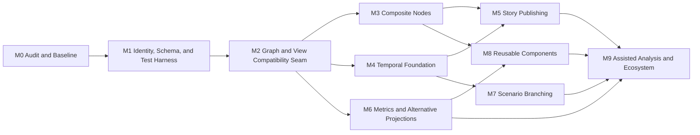

# Transformation Roadmap

## 1. Roadmap method

This roadmap orders work by architectural dependency and risk reduction, not by visual appeal. It assumes a working application and deliberately avoids calendar estimates until the repository audit measures complexity and team capacity.

Each milestone is a usable, testable increment. Work may overlap only where dependencies and compatibility gates are satisfied.

## 2. Programme principles

- Preserve a releasable mainline.
- Establish tests before extraction.
- Change persisted data only through versioned migrations.
- Deliver vertical slices.
- Keep advanced features behind controlled activation until stable.
- Prefer one shared graph/view/time model over feature-specific copies.
- Update documentation and ADRs with implementation evidence.

## 3. Milestone map

## 4. M0 — Repository audit and behavioural baseline

### Objective

Replace architectural assumptions with evidence and create a reproducible baseline.

### Deliverables

- Completed repository audit report.
- Current architecture and runtime diagrams.
- Build/test/deployment instructions.
- Format and compatibility matrix.
- Dependency and licence inventory.
- Baseline performance measurements.
- Accessibility and security baseline.
- Characterization tests for open/edit/save/render/undo.
- Repository-specific mapping from target responsibilities to current modules.
- Updated decision list and first work orders.

### Exit criteria

- Clean checkout can be built and run.
- Critical current flows have automated protection.
- Current identity, coordinate, and persistence semantics are known.
- First architecture seam is approved.

## 5. M1 — Stable identity, schema versioning, and test harness

### Objective

Make future graph references and migrations safe without changing the user experience.

### Deliverables

- Stable ID strategy and ADR.
- Schema-version detection.
- Legacy-to-current migration or compatibility mapping.
- Deterministic native serialization baseline.
- Round-trip fixture suite.
- Structured diagnostic model.
- Canonical fixture manifest and rights classes.
- CI gates for schema, migrations, and baseline flows.

### Exit criteria

- Existing maps open and save with no unexplained semantic loss.
- Node and edge identities survive rename and reorder.
- Migration tests cover oldest supported inputs.
- Unknown or newer formats fail safely.

## 6. M2 — Graph and view compatibility seam

### Objective

Separate durable graph meaning from current renderer state while preserving Wardley behaviour.

### Deliverables

- Graph facade or domain model over current state.
- Explicit default Wardley view.
- Renderer-neutral semantic snapshot.
- Current renderer adapter.
- Command/application-service seam for atomic changes.
- Dependency rules and tests.
- Equivalence tests between current and adapted Wardley rendering.

### Exit criteria

- Current editor runs through the seam for a representative map.
- Graph-domain tests do not require a browser.
- Current Wardley coordinates and appearance remain within approved equivalence.
- Renderer does not own persisted graph identity.

## 7. M3 — Composite nodes vertical slice

### Objective

Deliver non-destructive hierarchical abstraction end to end.

### Stage A — Read-only resolution

- Load authored composite fixtures.
- Resolve proxy nodes and boundary bundles.
- Render expanded and collapsed states.

### Stage B — Authoring

- Multi-select/lasso and accessible selection alternative.
- Create, rename, collapse, expand, and dissolve.
- Proxy position and boundary policy.
- Undo/redo.

### Stage C — Persistence and integration

- Save/load/migrate.
- Legacy export diagnostics.
- Projection and timeline-ready state contracts.
- Keyboard and accessibility.
- Performance profiling.

### Exit criteria

- Collapse/expand is identity-preserving.
- Save/reload and undo/redo pass.
- Boundary edges remain traceable.
- Existing non-composite maps are unaffected with flag on or off.

## 8. M4 — Temporal foundation

### Objective

Represent exact keyframe states and deterministic transitions.

### Stage A — Resolver

- Timeline and keyframe schema.
- Base-plus-patch materialization.
- Numeric, visibility, text, and categorical policies.
- Semantic snapshots at exact and intermediate times.

### Stage B — Editor

- Timeline controls.
- Keyframe creation, rename, reorder, and delete.
- Edit-on-keyframe rule.
- Playback and reduced motion.
- Undo/redo and persistence.

### Stage C — Structural change

- Node and edge lifecycle.
- Composite collapse state over time.
- Change summary.

### Exit criteria

- State at any supported time is deterministic.
- Existing static maps behave as before.
- Keyframes persist and are undoable.
- Browser playback and reduced-motion tests pass.

## 9. M5 — Story publishing

### Objective

Turn selected views and temporal states into a static interactive narrative.

### Stage A — Compiler foundation

- Story schema.
- Reference validation.
- One-chapter static directory output.
- Sanitization and asset handling.

### Stage B — Narrative runtime

- Multiple chapters.
- Scroll and explicit navigation.
- State transitions.
- Responsive layout and map summary.

### Stage C — Authoring and release

- Story editor and preview.
- Deterministic output checks.
- CSP, security, accessibility, and hidden-data review.
- Optional single-file mode.

### Exit criteria

- Representative story works without the editor backend.
- Headless browser tests assert state and navigation.
- Equivalent input builds deterministically.
- Public output excludes private data by default.

## 10. M6 — Metrics and alternative projections

### Objective

Allow explicit frames of reference over the same graph.

### Stage A — Metric foundation

- Definitions, values, units, status, confidence, and evidence references.
- Inspector/grid and validation.
- ID-based CSV import/export.
- Composite aggregation.

### Stage B — Projection engine

- Axis and scale definitions.
- Wardley adapter equivalence.
- Metric projection.
- Missing-data diagnostics.
- Manual overrides, pins, and constraints.

### Stage C — Comparison and transition

- Named views.
- Projection switch animation and reduced-motion alternative.
- Provenance trace.
- Story and timeline integration.

### Exit criteria

- Projection does not mutate graph topology.
- Values used for positions are inspectable.
- Determinism and performance targets pass.
- Current Wardley view remains first-class.

## 11. M7 — Scenario branching

### Objective

Support alternative futures with shared history.

### Deliverables

- Scenario identities and assumptions.
- Branch from exact time.
- Deterministic parent/branch resolution.
- Scenario selector.
- Structured difference view.
- Story references.
- Archive and ancestry validation.

### Exit criteria

- Sibling edits are isolated.
- Shared history is not duplicated semantically.
- Comparison uses stable IDs.
- Invalid ancestry fails safely.

## 12. M8 — Reusable components

### Objective

Reuse strategic subgraphs with controlled updates.

### Deliverables

- Component definition and instance formats.
- Entity ID mapping.
- Local overrides.
- Manual update proposals and conflicts.
- Detach operation.
- Local component library.
- Optional interface ports.

### Exit criteria

- Multiple instances remain distinct and traceable.
- Source updates never overwrite local changes silently.
- Save/load and migrations preserve mappings.
- Definition rights and provenance are recorded.

## 13. M9 — Assisted analysis and ecosystem

### Objective

Add analysis and AI assistance only after authoritative models and provenance are stable.

Potential deliverables:

- map explanation and change summary;
- inconsistency and missing-data detection;
- suggested composites or projection inputs;
- evidence-linked recommendations;
- governed projection and exporter extensions;
- public rights-cleared benchmark;
- optional collaboration adapters.

### Guardrails

- Suggestions are proposals, not silent edits.
- External data transfer is explicit.
- Model/version and evidence are recorded.
- Core product remains usable without AI.

## 14. Cross-milestone workstreams

### Testing and corpus

Begins at M0 and expands with every feature. No milestone can defer all tests to the end.

### Security and accessibility

Baselined at M0, included in each vertical slice, and gated before release.

### Documentation and ADRs

Updated continuously. Accepted decisions supersede proposed draft text.

### Performance

Baseline, measure, profile, and set evidence-based budgets. Do not optimize speculative bottlenecks while ignoring measured ones.

### User validation

At each user-visible milestone, test representative workflows with strategy authors, facilitators, and story consumers.

## 15. Initial epics

Machine-readable initial epics and tasks are in `plans/initial-backlog.yaml`. Recommended first issues:

1. Audit exact fork and build baseline.
2. Create current-format semantic round-trip fixture.
3. Identify and test stable node and edge identity.
4. Add schema-version diagnostic.
5. Create renderer-neutral snapshot of current Wardley view.
6. Implement composite membership closure and cycle tests.
7. Render a pre-authored collapsed composite behind a flag.
8. Complete composite create/save/load/undo vertical slice.

## 16. Prioritization rules

When choosing work within a milestone, prioritize:

1. data-loss and security risk;
2. missing test safety net;
3. architecture dependency;
4. end-to-end user value;
5. accessibility blockers;
6. performance evidence;
7. convenience and polish.

## 17. Roadmap change control

A roadmap change should state:

- evidence or user need;
- affected dependencies;
- compatibility impact;
- test/corpus impact;
- accepted ADR or decision;
- what is deferred or removed.

Adding a high-level feature without identifying its model dependencies is not a valid roadmap change.
