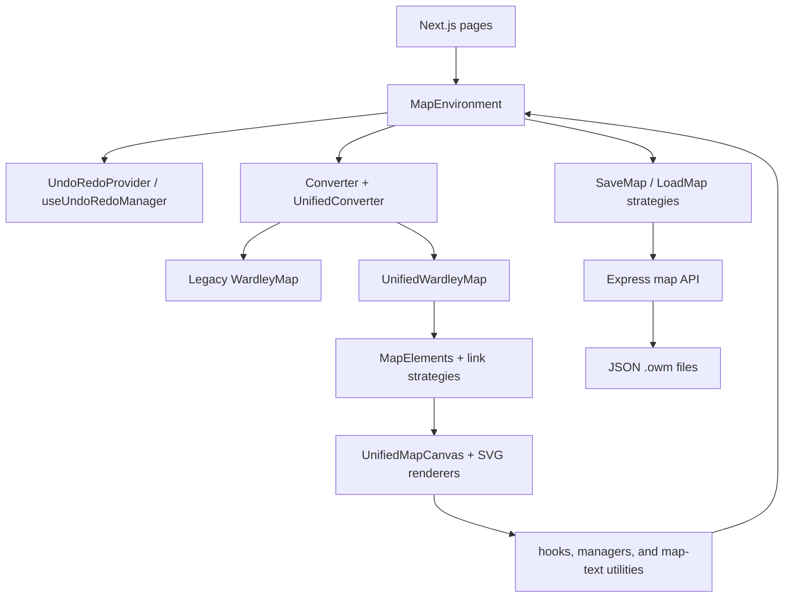
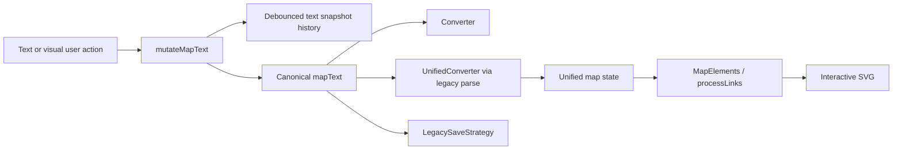

# Repository Audit Report

- **Repository:** `https://github.com/damonsk/onlinewardleymaps.git`
- **Local path:** `/Users/alastair/Documents/WarleyMaps`
- **Branch:** `main`
- **Baseline commit:** `71f2aad88ae83862fdce27c55c6733b8ba1009aa`
- **Audit date:** 2026-07-16
- **Auditor:** Codex
- **Work order:** [`AUD-EPIC-000`](../work-orders/AUD-EPIC-000.md)
- **Local changes:** The audit began with 79 tracked files modified and 541 untracked paths. Audit artifacts and CI configuration add to those counts. Existing changes are treated as user-owned and are not normalized or discarded.
- **Scope:** Current working tree, with the baseline commit recorded separately

## 1. Executive findings

OnlineWardleyMaps is a mature browser editor whose durable authoring representation is an OWM text DSL. Direct text edits and visual interactions both change `mapText`; the application reparses that text into legacy and unified in-memory representations, derives render-ready collections, and draws an interactive SVG map. Remote persistence stores the source text plus named full-text iterations in a small file-backed API.

The roadmap's incremental approach is viable and preferable to a rewrite. The repository already contains useful seams: conversion strategies, a `UnifiedWardleyMap` adapter, `MapElements` processing, centralized map-text mutation, snapshot undo/redo, save/load strategies, modular SVG renderers, feature switches, and a reusable `wmlandscape` package.

The application does not yet meet the target strategic-graph architecture. Component identity is based on source line or display name, links have no independent ID and resolve endpoints by label, coordinates live on components, the unified model is derived from the legacy parser, and there is no versioned native codec or migration chain. Composites, temporal resolution, projections, metrics, stories, scenarios, and reusable component instances are not implemented. Maplettes and map iterations are useful precursors but do not satisfy those feature semantics.

At audit start, the production builds and lint passed but the frontend suite had six failing suites and 23 failing tests. The bounded baseline repair now passes locally and is represented in one application-baseline workflow. The remaining integration blockers are a hosted green workflow run, a browser-level editor/API journey, accessibility evidence, owner review, and an owner-approved snapshot of a working tree that remains substantially ahead of its recorded commit.

Recommended first architecture seam after M0: wrap current parsing and raw-text persistence in a versioned document-codec facade, then expose a graph/view facade over `UnifiedWardleyMap` and `MapElements`. Preserve the current DSL as an input and compatibility format until the stable-ID storage decision is approved.

## 2. Reproduction

### Environment

| Item | Audited value | Notes |
|---|---|---|
| Operating system | macOS 26.5.1, arm64 | Local audit host |
| Git | 2.50.1 (Apple Git-155) | Repository operations |
| Installed Node | 20.5.1 | Too old for Next.js 16.2.9 |
| Verified Node | 24.14.0 | Bundled runtime used for local build and smoke test |
| CI/container Node | 22.22.1 / Node 22 Alpine | Supported target recorded by workflows and Dockerfile |
| Yarn | 1.22.22 through Corepack | `frontend/yarn.lock` and `api/yarn.lock` are v1 locks |
| Python | 3.11.3 | Roadmap validation uses a virtual environment |

The README and baseline workflow now document Node `>=20.9.0` and use Node 22 as the reproducible default.

### Install

Audited clean-install commands:

```sh
corepack enable
cd frontend && yarn install --frozen-lockfile
cd ../api && yarn install --frozen-lockfile
```

Existing `node_modules` directories were present during the local audit. The new application-baseline workflow performs clean installs on GitHub Actions and is the clean-environment evidence path.

### Run

Development command:

```sh
cd frontend
yarn dev
```

Production smoke test used a completed build:

```sh
cd frontend
yarn start -p 3010
curl http://127.0.0.1:3010/
```

Observed result: server ready in approximately 125 ms; `/` returned HTTP 200 with `text/html`.

### Build

| Command | Result | Observed time / note |
|---|---|---|
| `cd frontend && yarn build` | Pass with supported Node | Observed range approximately 10.9–13.3 s; 29 static pages generated |
| `cd api && yarn build` | Pass | Approximately 0.8 s |
| `cd frontend && yarn build` with Node 20.5.1 | Fail before build | Next.js requires Node `>=20.9.0` |

### Test

Initial full-suite command:

```sh
cd frontend
yarn test --runInBand
```

Initial result: 166 passing suites, 6 failing suites, 2,036 passing tests, 23 failing tests, 2 skipped tests, approximately 30.1 seconds. Failure classes were accidental helper discovery, toolbar/map-text integration drift, stale accessibility and thumbnail expectations, and golden-master semantic drift.

Final repaired result: 172 passing suites, 2,062 passing tests, 2 skipped tests, no failures, and approximately 19.0 seconds. This includes the new small/medium/large performance characterization. The API now has a built-in Node test that saves a synthetic record, verifies it in the isolated data directory, fetches the record, and compares DSL plus JSON-encoded iterations exactly. It does not replace the still-missing browser editor/API journey.

### Static checks

`yarn lint:check` passes with 17 `react-hooks/exhaustive-deps` warnings and no errors. The frontend production build runs TypeScript validation. The API build runs `tsc -p tsconfig.json` with strict checking.

### Roadmap validation

The validator requires PyYAML, jsonschema, and referencing, which were not previously declared. Pinned direct requirements now live in `roadmap/requirements.txt`. Validation now also checks that the manifest contains every pack file with the correct byte count and SHA-256 checksum.

```sh
python -m pip install --requirement roadmap/requirements.txt
python roadmap/tools/validate_pack.py
```

Observed result after installing the pinned dependencies: validation passed for the manifest, schemas, examples, links, YAML, CSV registers, and references.

### Deploy/preview

- Root `Dockerfile`: builds and runs the Next.js frontend on Node 22 Alpine.
- `api/Dockerfile`: builds and runs the Express API on Node 22 Alpine.
- `docker-compose.yml`: joins frontend and API and mounts a host data directory.
- `.github/workflows/docker-publish.yml`: publishes tagged frontend and API images to GHCR.
- `.github/workflows/docker-deploy.yml`: deploys the images on a labelled self-hosted runner.

The audit did not mutate the configured self-hosted deployment, publish images, or reproduce either Docker image build. Neither Dockerfile uses a frozen install; `api/Dockerfile` does not copy `yarn.lock`, and no root `.dockerignore` was found despite large local dependency trees. Treat container reproducibility and build context size as unverified until image builds are added to a clean gate.

## 3. Upstream and licence

- `origin` fetch and push URL: `https://github.com/damonsk/onlinewardleymaps.git`.
- No separate fork or upstream remote is configured.
- Root and frontend source licences: MIT, copyright Damon Skelhorn, 2019.
- Wardley Maps book material under `docs/wardley-maps-book/` declares Simon Wardley's CC BY-SA 4.0 licence and includes page/object/checksum provenance.
- The semantic book-map catalogue is derived from that material and needs an explicit distribution/attribution review for the combined product and generated fixtures.
- The Structural Deepening catalogue records source URLs and author presentation but no repository-local licence or permission classification. Treat public distribution as unresolved until reviewed.
- No consolidated third-party notices file was found outside dependency-provided notices.

## 4. Technology inventory

| Area | Technology/version | Entry point | Notes/risk |
|---|---|---|---|
| Language | TypeScript, JavaScript | `frontend/src`, `api/src` | Frontend is strict but permits JS and skips library checks |
| UI | React 19.2.7, Next.js 16.2.9 Pages Router | `frontend/pages/index.tsx` | Browser-oriented editor; SSR-sensitive Ace loading |
| Components | MUI 9, Emotion, styled-components | UI modules | Multiple styling systems increase integration surface |
| Editor | Ace via `react-ace` | `components/editor/Editor.tsx` | OWM DSL is directly user editable |
| State | React hooks and contexts | `useUnifiedMapState`, providers | No reducer/transaction store; `MapEnvironment` remains orchestrator |
| Parser | Custom extraction strategies | `conversion/Converter.ts` | Runs alongside a legacy-to-unified adapter |
| Domain adapter | `UnifiedWardleyMap` | `types/unified`, `UnifiedConverter.ts` | Renderer-ready and name/coordinate coupled; not durable graph domain |
| Rendering | React SVG, `react-svg-pan-zoom` | `UnifiedMapCanvas.tsx` | Existing renderer must be preserved through an adapter |
| Coordinates | Normalized maturity/visibility plus SVG pixels | `ModernPositionCalculator.ts` | DSL order is `[visibility, maturity]`; screen Y is inverted |
| Persistence client | Strategy classes plus Fetch API | `frontend/src/repository` | Only `Legacy` strategy is live |
| Persistence server | Express 5, filesystem JSON | `api/src/index.ts` | No authentication, ownership, concurrency, or database |
| Unit/integration tests | Jest 30, Testing Library, jsdom | `frontend/jest.config.js` | Broad suite but no real-browser journey |
| Browser automation | None configured | — | M0 gap |
| Accessibility automation | None configured | — | ARIA/keyboard tests and a bounded browser smoke exist; no axe gate or full manual journey |
| Build | Next Turbopack, TypeScript | package scripts | Supported Node prerequisite was undocumented |
| Deployment | Docker, Compose, GHCR, self-hosted runner | root and `.github/workflows` | Existing deployment remains authoritative |
| Dependency updates | Dependabot | `.github/dependabot.yml` | No dedicated dependency-vulnerability gate found |

## 5. Current architecture

### Container/module view



### Runtime source-of-truth flow



The unified model reduces type fragmentation but does not yet replace the DSL or legacy converter. `useMapParsing` runs both parsers on each source change, and `MapEnvironment` also parses through `UnifiedConverter` during mutation.

## 6. User-flow traces

### Create and move a node

Creation through the toolbar:

1. `UnifiedMapCanvas` forwards normalized pointer intent through `useMapEventHandlers`.
2. `useDrawingToolbarHandlers.handleToolbarItemDrop` validates the position.
3. `handleStandardItemDrop` calls `placeComponent` in `utils/mapTextGeneration.ts`.
4. The resulting DSL text is passed to `MapEnvironmentWithUndoRedo.mutateMapText` with a typed action description.
5. Undo history records the before/after text, unified state is rebuilt, and `useMapParsing` refreshes legacy presentation data.
6. `MapElements`, `processLinks`, and the SVG renderer rerender.

Movement:

1. `Movable` produces final SVG coordinates.
2. `MapComponent.updatePosition` converts X to maturity and Y to visibility with `ModernPositionCalculator`.
3. `updateMapElementPosition` rewrites the source line at `component.line`, matching by normalized name and rounding both values to two decimals. Multi-selected maplette members use `translateMapletteSelection` instead.
4. The normal mutation, history, parse, and render cycle runs.

Persistence effect: source text changes immediately and is marked dirty; remote persistence occurs only on explicit save.

### Create and delete an edge

Creation:

1. Linking state retains a source `UnifiedComponent`.
2. `useComponentLinkingOperations.createLink` calls `addLinkToMapText`.
3. Link syntax uses escaped source and target display names, and the line is inserted after the last top-level node/pipeline block.
4. A `toolbar-link` text mutation is recorded and reparsed.

Deletion:

1. Selection/context interaction supplies `{start, end, flow, flowValue, line}`.
2. `useComponentOperations.handleDeleteLink` delegates to `LinkDeleter` or the deletion strategy.
3. The corresponding source line is removed and a `canvas-delete` text mutation is recorded.

Identity and direction: links have start/end labels, optional flow/past/future/context fields, and sometimes a source line. They do not have durable edge IDs. Endpoint lookup is name based, so duplicate labels are ambiguous.

### Open an existing map

1. The page/hash supplies `currentId` and legacy persistence strategy.
2. `useMapPersistence.loadFromRemoteStorage` calls `LoadMap`.
3. `LegacyLoadStrategy` fetches `GET /v1/maps/fetch?id=<id>`, reads `text`, and parses the JSON-encoded `mapIterations` field.
4. The callback applies the top-level text. If iterations exist, it selects index zero and applies that iteration's text.
5. The standard parse/render cycle runs.

There is no schema-version detection, migration, structured validation, response-status abstraction, or preservation of unknown top-level API fields.

### Save and export a map

Remote save:

1. `useMapPersistence.saveMap` builds `OwnApiWardleyMap` with source text and iteration snapshots.
2. `SaveMap` selects `LegacySaveStrategy`.
3. The client posts `{id, text, mapIterations}` to `/v1/maps/save`.
4. The API validates the ID character set and field primitive types, then overwrites or creates `<id>.owm` with pretty-printed JSON.
5. New IDs are UUIDs; the URL hash is updated after the first save.

Exports in `MapEnvironment`:

- Mermaid `.mmd` from the unified map;
- Mermaid clipboard text;
- PNG from the rendered SVG via `html2canvas`;
- standalone SVG assembled from the current DOM.

Mermaid import accepts pasted `wardley-beta` content, converts it to OWM DSL, validates it with the current parser, and replaces the active map text. There is no native `.owm` file picker or advanced JSON document codec.

### Undo and redo

`UndoRedoProvider` wraps `useUndoRedoManager`. Normal changes record previous/current map text, action type, description, timestamp, and optional group ID. Entries are debounced, consecutive moves/text edits can group, stacks are bounded to 50, and undo/redo applies complete source-text snapshots. History is transient and does not include all UI/local-storage state or independently changing iteration metadata.

### Map-level settings and presentation

Title, style, size, axes, annotations, and related map properties are parsed from and written back to DSL lines through managers such as `MapTitleManager` and `MapPropertiesManager`. Pan/zoom state, panel layout, toolbar position, language, and display preferences are transient React state or local storage. The current boundary between authored view state and local editor preference is implicit rather than a versioned view model.

## 7. Domain-model inventory

| Entity/concept | Current representation | Identity | Coordinates | Persistence | Coupling |
|---|---|---|---|---|---|
| Document | `mapText`, `OwnApiWardleyMap` | Remote map ID/URL hash | Map size in DSL | API JSON wrapper | Editor and persistence source of truth |
| Legacy map | `WardleyMap` | None at map level | Entities carry normalized values | Derived only | Parser and legacy compatibility |
| Unified map | `UnifiedWardleyMap` | None at map level | Entities still carry maturity/visibility | Derived only | Renderer-ready adapter |
| Component | `MapElement`, `Component`, `UnifiedComponent` | Legacy source-line ID or unified name-derived ID | Maturity/visibility on entity | DSL source line | Labels, renderer, selection, links |
| Anchor/submap/market/ecosystem | Specialized legacy collections represented as unified components | Same line/name mechanisms | Maturity/visibility | DSL | Type/decorator and renderer coupling |
| Edge | `MapLinks`, `FlowLink` | No independent durable ID | Endpoints derived at render time | DSL label-to-label line | Link strategies resolve by name |
| Pipeline | Legacy pipeline plus `PipelineData` | Line or name-derived ID | Parent visibility and child maturity | DSL block | Child identity and rendering |
| Evolved state | `EvolvedElementData` plus derived unified component | Name reference and `_evolved` suffix | Maturity plus base visibility | DSL `evolve` line | Matched by name/override |
| Maplette | `MapletteDefinition` plus annotations on components/links | Slug derived from name | Members retain coordinates | DSL block | Membership inferred from line range |
| Iteration | `MapIteration` | Array position and mutable name | Complete map-text snapshot | JSON string within saved record | UI swaps canonical text |
| Note/annotation/overlay/table/profile | Legacy types or dedicated parsed utilities | Mostly line/array position | Normalized or raw asset coordinates | DSL | Presentation-specific renderers |
| Selection | `ComponentSelectionContext` | Current component IDs plus names/lines | None | Transient | IDs are not durable across rename/reorder |
| Undo entry | `HistoryEntry` | Generated transient history ID | None | Transient | Complete map-text snapshots |

Critical identity findings:

- Legacy base element IDs default to one-based source line numbers.
- Unified component IDs fall back to `${type}_${normalizedName}`.
- Pipeline child IDs may derive from parent/index or name.
- Render lists frequently use array indexes as React keys.
- Links and evolved references use labels.
- Duplicate display labels cannot be treated as distinct durable graph entities.
- IDs do not survive rename and may change when lines are inserted or reordered.

## 8. Format inventory

| Format/version | Read | Write | IDs | Unknown data | Known loss/gap | Fixture status |
|---|---:|---:|---|---|---|---|
| OWM DSL text, unversioned | Yes | Yes | Implicit line/name IDs | Raw text is retained by remote save; targeted visual edits generally preserve unrelated lines | No formal grammar version or migration; parser support varies by directive | Extensive parser and catalogue examples, no formal round-trip matrix |
| API `.owm` JSON wrapper, unversioned | Yes | Yes | Document ID only | Unknown wrapper fields are not represented and would be dropped | Iterations are a JSON-encoded string; overwrite is unconditional | Synthetic save/file/fetch round trip exists; browser client journey missing |
| Mermaid Wardley `wardley-beta` | Yes, pasted | Yes, `.mmd`/clipboard | Labels | Unsupported syntax is rejected | Only the mapped subset is converted; no formal loss report | Unit tests exist |
| PNG | No | Yes | None | Not applicable | Raster, presentation only | Manual visual artifacts exist |
| SVG | No | Yes | DOM IDs are not domain IDs | Not applicable | Presentation snapshot, not semantic round trip | Component tests/manual use |
| Advanced strategic-map JSON draft | Examples only | No application codec | Draft stable IDs | Schema defines extension points | Not connected to editor or persistence | Roadmap schema/examples validate |

Newline and formatting behaviour varies by mutation utility. `updateMapElementPosition` preserves the surrounding source line while rounding coordinates to two decimals; some placement paths normalize line endings. Deterministic semantic serialization is not defined because source text, comments, order, and whitespace remain user-authored.

## 9. State and command model

`useUnifiedMapState` is the consolidated React state holder. It owns source text, unified parsed map, render dimensions, presentation state, errors, selection-related values, and loading flags. `useLegacyMapState` exposes compatibility slices and setters to older consumers.

There is no application command bus or reducer transaction boundary. The practical command seam is the typed `mutateMapText(newText, actionType, description, groupId)` path plus focused services and hooks. This is sufficient for a compatibility facade: initial commands can calculate one atomic source-text delta and reuse current undo. It is not sufficient for advanced state stored outside `mapText` unless that state is included in the same document transaction.

Feature switches are static values supplied through `FeatureSwitchesContext`. They can host the first roadmap flags, but need environment/default policy, owner, tests in both states, and removal conditions.

## 10. Renderer and interaction model

- Renderer: React SVG under `UnifiedMapCanvas` with pan/zoom through `react-svg-pan-zoom`.
- Logical coordinates: maturity increases left to right; visibility increases bottom to top. Screen conversion is `x = maturity * width`, `y = (1 - visibility) * height`.
- Rendering derivation: `UnifiedWardleyMap` → `MapElements` → link strategies/processors → component/link/annotation/PST renderers.
- Selection: component context supports multi-selection; link selection has a separate service path.
- Drag: pointer-based `Movable`, with component/source-line rewriting at drag end.
- Lasso: no general roadmap composite lasso was found.
- Keyboard: toolbar shortcuts, undo/redo, deletion, Escape clearing, and maplette selection growth have tests.
- Responsive/pan/zoom: split-pane sizing and toolbar/camera preferences are stored locally.
- Touch: pointer/touch behaviour exists in selected elements, but no audited supported-device matrix was found.
- Animation: CSS animations exist; no `prefers-reduced-motion` policy was found.

The smallest renderer seam is a new renderer-neutral semantic snapshot produced immediately before `UnifiedMapContent`, while preserving `UnifiedMapCanvas` as the Wardley adapter.

## 11. Test inventory and gaps

At audit start Jest discovered 172 suites. Coverage includes parser strategies, golden converter output, map elements, link strategies, toolbar behaviour, component rendering, selection, deletion, undo/redo, pipelines, PST geometry, Mermaid conversion, maplette operations, book maps, and integration-style jsdom workflows.

Strengths:

- Broad pure/parser coverage.
- Existing golden masters protect legacy converter and `MapElements` output.
- Many mutation and interaction utilities are testable without a running server.
- Keyboard and ARIA assertions exist in component tests.
- Some coordinate and link algorithms have micro-performance assertions.

Gaps after the bounded M0 repair:

- No repeatable real-browser end-to-end harness.
- No frontend open/edit/save/reopen journey against the API; the direct API persistence round trip is covered.
- No version/migration/unknown-field tests.
- No native semantic round-trip fixture matrix.
- No automated visual regression harness; current PNG evidence is manual and local.
- No automated accessibility scanner or recorded manual screen-reader review.
- The new application-baseline workflow has not yet run on GitHub from this uncommitted tree.

## 12. Accessibility baseline

Verified implementation support includes native MUI buttons/dialogs, accessible toolbar names and pressed state, live-region keyboard announcements, keyboard shortcuts, inline-editor keyboard isolation, focusable controls, and ARIA descriptions for PST/drag/resize UI.

A bounded in-app browser smoke loaded the production build after dismissing the release dialog. It confirmed `lang="en"`, a descriptive document title, one labelled map toolbar, labelled map-toolbar actions, one live region, and no captured console warnings. The same DOM inspection found no `main` landmark or `h1`, and the header `more-menu-button` has no accessible name. These are actionable baseline observations, not an automated conformance result.

Unresolved or missing evidence:

- no WCAG conformance claim;
- no automated axe-style gate;
- no recorded keyboard-only full journey;
- no screen-reader semantic map representation;
- no verified focus restoration matrix;
- no reduced-motion media-query policy despite multiple CSS animations;
- no audited contrast/reflow report across themes and zoom levels.

Classification: useful foundation, M0 baseline incomplete.

## 13. Security baseline

Positive controls:

- API map IDs are restricted to alphanumeric, underscore, and hyphen, preventing direct path traversal through IDs.
- Express JSON bodies are limited to 10 MB.
- React text rendering provides default escaping for normal labels.
- Mermaid import rejects unsupported syntax and reparses converted OWM DSL before applying it.

Material gaps:

- API uses unrestricted CORS and has no authentication, authorization, ownership, privacy, rate limiting, or optimistic concurrency.
- Knowledge of a map ID permits reading; posting an existing ID overwrites it.
- Stored files have no schema validation, checksum, atomic-write/backup policy, or corruption recovery beyond an error response.
- `window.open` receives map-defined URLs without a scheme allow-list or explicit `noopener`; `javascript:` and opener-capable navigation must be treated as a potential document-driven execution/navigation risk until constrained.
- Development logging includes component names and operational details; no sensitive-content logging policy is enforced in code.
- No dependency/security scan is a required CI gate.
- Imported/parsed DSL has no explicit document complexity limits beyond request-body size.
- Corpus licence classification is incomplete for non-book external maps.

No story compiler or rich HTML surface exists yet, so story injection/privacy requirements remain future work rather than current regressions.

## 14. Performance baseline

| Dataset/operation | Result | Status |
|---|---|---|
| Full Jest suite at audit start | Approximately 30.1 s | Measured, but suite failing |
| Final repaired frontend suite | Approximately 19.0 s | 172 suites pass; 2,062 tests pass and 2 skip |
| Frontend production build | Approximately 10.9–13.3 s | Repeated measurements, pass |
| API TypeScript build | Approximately 0.8 s | Measured, pass |
| Frontend lint | Approximately 10.1 s | Measured, 17 warnings |
| Production server readiness | Approximately 125 ms after process start | Smoke measurement |
| Local HTTP `/` response | Approximately 14 ms | Smoke measurement |
| 25-node/40-link parse plus render-ready state | Median approximately 1.8 ms | Three measured runs after warm-up |
| 200-node/400-link parse plus render-ready state | Median approximately 25.9 ms | Three measured runs after warm-up |
| 1,000-node/2,000-link parse plus render-ready state | Median approximately 395.2 ms | Three measured runs after warm-up |
| Large-map browser drag/pan/save/memory | Not measured | Required follow-up |

The deterministic characterization parses through `UnifiedConverter`, derives `MapElements`, and processes links. Its generous 30-second anti-catastrophic ceiling is a regression tripwire, not a product performance budget. Browser interaction and memory budgets remain provisional.

## 15. Compatibility matrix

| Behaviour/artifact | Current contract | Evidence | Proposed treatment |
|---|---|---|---|
| OWM DSL editing | Preserve exact source where no edit occurs; preserve semantics for targeted edits | Editor, converter and mutation tests | Preserve; characterize before codec work |
| Existing remote map IDs and hash URLs | Preserve exactly | Repository strategies and page lifecycle | Keep legacy adapter |
| API save/load payload | Preserve until versioned codec is approved | `LegacySaveStrategy`, API source | Wrap; do not silently replace |
| Map iterations | Preserve current named full-text snapshots | Iteration UI and persistence hook | Audit as compatibility input to future timeline migration |
| Node placement/drag | Preserve semantic coordinates and current two-decimal write behaviour | Map component and position tests | Characterize and route through command facade later |
| Links and flows | Preserve current direction/flow/context syntax | Parser and link-strategy tests | Add IDs through migration, never reinterpret labels silently |
| Evolve/pipeline/PST behaviour | Preserve semantically and visually | Existing unit/integration/golden tests | Keep behind renderer compatibility adapter |
| Undo/redo | Preserve user-visible source-text history | Undo provider/manager tests | Reuse for atomic text commands; expand transaction scope later |
| Keyboard shortcuts | Preserve exactly unless announced deprecation | Keyboard tests and toolbar constants | Add browser journey |
| SVG/PNG output | Preserve visually within reviewed tolerance | Export source and manual evidence | Add selected visual regression |
| Mermaid import/export | Preserve supported subset; make future loss explicit | Mermaid unit tests | Wrap as codec with diagnostics |
| `wmlandscape` package exports | Preserve public embedding surface | Package build/workflow | Include in future adapter compatibility testing |
| Book-map catalogue | Preserve only after licence/attribution review | Catalogue, source manifest and tests | Assign rights class and distribution scope |
| Browser matrix | Browserslist: maintained browsers plus current Chrome/Firefox/Safari in development | `frontend/package.json` | Confirm product support and add browser smoke tests |
| Docker/Compose deployment | Preserve | Dockerfiles and workflows | Keep authoritative |

## 16. Candidate architecture seams

| Target seam | Current modules | Difficulty | Risk | Recommendation |
|---|---|---:|---:|---|
| Document codec | `Converter`, `UnifiedConverter`, repository strategies | Medium | High | First M1 seam: detect legacy text, retain source, emit structured diagnostics |
| Stable identity | Base strategy runners, unified types, link/evolve matching | High | Critical | Decide inline IDs, sidecar, or advanced native format before implementation |
| Graph access | `UnifiedWardleyMap`, `useUnifiedMapState` | Medium | High | Add read-only facade first; do not make renderer types the durable schema |
| Default Wardley view | Component maturity/visibility, map properties | Medium | High | Adapt current coordinates into an explicit view with equivalence tests |
| Display graph | `MapElements`, `processLinks`, renderer props | Medium | High | Produce semantic snapshot before SVG-specific components |
| Command/undo | `mutateMapText`, hooks/services, undo provider | Medium | Medium | Introduce typed intent facade that initially emits one source-text delta |
| Selection | Component and link selection contexts | Medium | Medium | Reuse for composite authoring after stable IDs; add accessible list path |
| Renderer adapter | `UnifiedMapCanvas`, `UnifiedMapContent`, renderers | Medium | High | Preserve renderer and adapt input; do not replace it |
| Timeline input | `MapIteration` | High | High | Treat iterations as legacy snapshots, not keyframes; design explicit migration |
| Static export | Mermaid/SVG/PNG exports, `wmlandscape` | Medium | Medium | Reuse display state later; story runtime remains separate |

## 17. Risk and debt register

| Classification | Finding | Consequence / response |
|---|---|---|
| Resolved locally | Full Jest baseline initially failed | Bounded repairs and full-suite verification restore the local gate; hosted CI evidence remains |
| Blocker | Working tree is far ahead of recorded commit | Record exact scope; obtain a stable integration snapshot before architectural changes |
| High | Node/link identity depends on line/name | M1 stable-ID decision and migration tests required |
| High | No schema version or migration chain | Add codec/version diagnostic before persisted advanced state |
| High | Duplicate labels are ambiguous for links and evolved state | Do not build composites or timelines on current label identity |
| High | API has no access control or concurrency protection | Clarify deployment/privacy contract before public collaboration features |
| High | No frontend API-backed open/edit/save/reopen journey | Direct API save/fetch is covered; add browser client coverage |
| High | Map-defined URLs are opened without scheme/opener controls | Add a safe scheme policy and `noopener` behaviour with tests |
| High | External corpus rights metadata incomplete | Classify before public distribution or roadmap corpus reuse |
| Medium | `MapEnvironment` coordinates many responsibilities | Extract facades incrementally behind characterization tests |
| Medium | Legacy and unified parsing repeat work and models overlap | Retire only after equivalence; do not optimize prematurely |
| Medium | Renderer receives domain-like objects with direct mutation callbacks | Insert semantic display-state adapter |
| Medium | Undo omits state outside map text | Expand transaction boundary with new persisted concepts |
| Medium | Static feature flags lack lifecycle metadata | Extend existing context for roadmap flags |
| Resolved locally | Host runtime prerequisite was inaccurate | Node 22 is documented and configured in the baseline workflow |
| Medium | No complete accessibility baseline | Complete automated and manual evidence before M0 exit or first user-visible vertical slice |
| Medium | Container builds and contexts are not reproducible evidence | Use lockfiles/frozen installs, add `.dockerignore`, and verify clean image builds |
| Low | 17 hook dependency warnings | Triage separately; do not combine with architecture work |
| Observation | Raw text persistence naturally retains comments and unknown lines | Preserve this compatibility advantage in codec design |

## 18. Draft-document corrections

| Draft assumption | Audit result | Correction |
|---|---|---|
| Repository/framework unknown | Confirmed Next.js/React/TypeScript with custom DSL and SVG | Replace generic module placeholders with the mappings in this report |
| Stable IDs may exist | Rejected | IDs are line/name/index-derived; links have no durable ID |
| Current model may be coordinate centric | Confirmed | Maturity/visibility are entity properties and renderer inputs |
| Command model may exist | Partially confirmed | Central mutation and typed undo actions exist; no formal command bus/transaction model |
| Feature flags may be absent | Rejected | Static `FeatureSwitchesContext` exists and can be extended |
| Renderer seam viability unknown | Partially confirmed | `UnifiedWardleyMap` → `MapElements` → renderer is a viable compatibility path |
| Existing temporal capability unknown | Clarified | Named full-text iterations exist but are not a deterministic timeline model |
| Corpus starts from synthetic fixtures | Changed by working tree | A large CC BY-SA book-derived catalogue and a blog-derived catalogue already exist; govern them explicitly |
| Core deployment may be static only | Rejected for current product | Current save/load depends on an optional Express API; frontend editing itself remains browser hosted |

No accepted ADR conflicts were found because roadmap ADRs remain Proposed. Current evidence strongly supports ADR-0001. ADR-0002 and ADR-0003 describe target changes rather than existing behaviour.

## 19. Recommended first milestones

### Finish M0

1. Completed locally: restore current Jest suites to green with reviewed golden semantics.
2. Defined and verified locally: frontend test/lint/build/smoke, API test/build/smoke, and roadmap validation in the application-baseline workflow. A hosted green run remains required.
3. Completed at the API boundary: exact save/file/fetch characterization. Still add the browser editor open/edit/save/reopen journey and a current-format semantic fixture matrix.
4. Partially completed: bounded DOM/accessibility smoke recorded. Still add a keyboard-only journey, scanner, and manual assistive-technology evidence.
5. Completed for parse/render-ready state: deterministic small, medium, and large measurements. Browser drag/pan/save/memory remains later performance work.
6. Pending owner action: freeze or commit an approved integration snapshot; this audit does not commit user changes.

### M1 design gate

1. Decide how stable IDs coexist with the hand-authored DSL: inline directives, sidecar metadata, or an advanced native document with a lossless legacy-text adapter.
2. Define `DocumentCodec` detection/result/diagnostic interfaces around current repository strategies.
3. Add a schema-version diagnostic without changing legacy save output unless advanced state is used.
4. Add rename, reorder, duplicate-label, round-trip, unknown-data, and migration fixtures.

### M2 thin seam

1. Add a read-only graph facade over the unified parsed state.
2. Materialize current maturity/visibility as a named default Wardley view.
3. Produce a renderer-neutral semantic snapshot and prove current rendering equivalence.
4. Route one existing edit intent through a typed command facade before composite work.

## 20. Decisions requiring owner approval

1. Is OWM DSL still the durable authoring source for advanced documents, or is a versioned native document/sidecar acceptable?
2. Which current behaviours are contractual: iterations, URL-hash IDs, exact source formatting, catalogue maps, and package exports?
3. Should duplicate labels become supported in the current DSL, and how should legacy label references be disambiguated?
4. Is the file-backed API intended for trusted/self-hosted use only, or must M1 include authentication/privacy/concurrency work?
5. Are the book and Structural Deepening catalogues approved for public distribution under recorded licence terms?
6. Which browser and accessibility support level is a release requirement?

## 21. Audit acceptance checklist

- [x] Repository, branch, commit, remote, licence, and local-change state recorded.
- [x] Technology, build, test, lint, runtime, API, and deployment paths identified.
- [x] Create/move, edge, open, save/export, undo/redo, and settings flows traced to real modules.
- [x] Current identity, coordinate, state, renderer, and persistence semantics documented.
- [x] Initial format and compatibility matrices created.
- [x] Target responsibilities mapped to current modules and candidate seams.
- [x] Security, accessibility, rights, test, and performance gaps classified.
- [x] Repository-specific work order issued.
- [x] Full frontend suite passes locally.
- [ ] Clean CI baseline passes on the recorded runtime.
- [x] Direct API save/persist/reopen characterization test exists.
- [ ] Browser editor/API open/edit/save/reopen characterization test exists.
- [x] Representative small/medium/large parser and render-ready-state measurements exist.
- [ ] Automated and manual accessibility baseline evidence exists.
- [ ] Owner reviews the compatibility matrix and M1 storage/identity decision.

M0 remains in progress until the unchecked evidence is completed or explicitly deferred by an owner with recorded risk.
